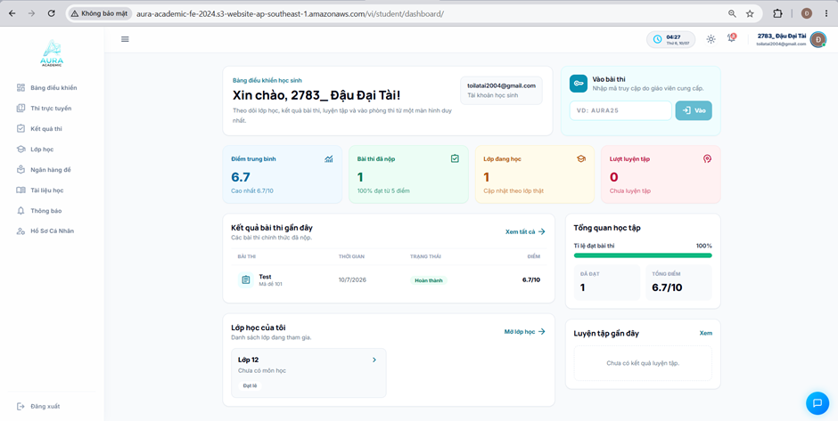
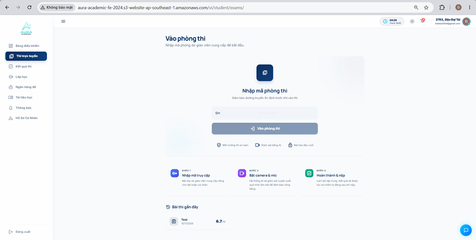
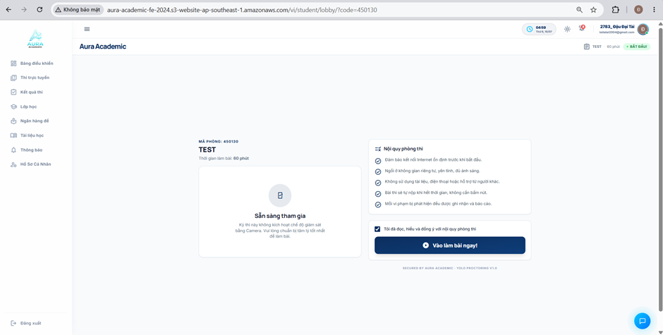
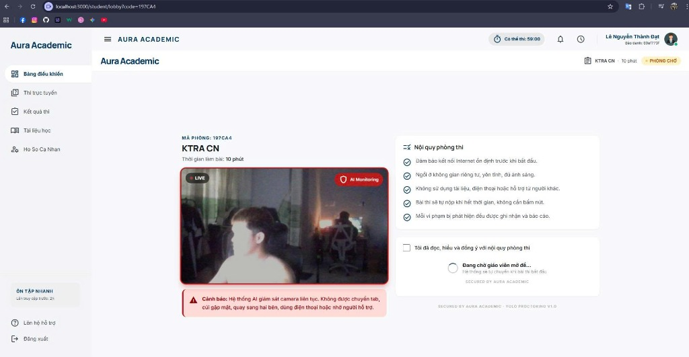
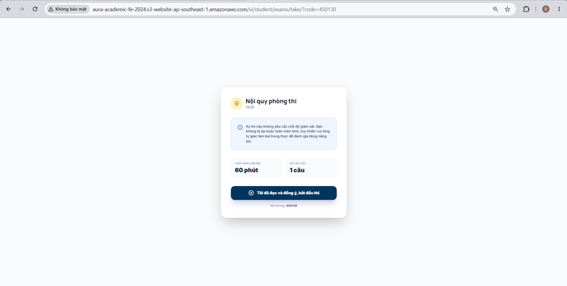
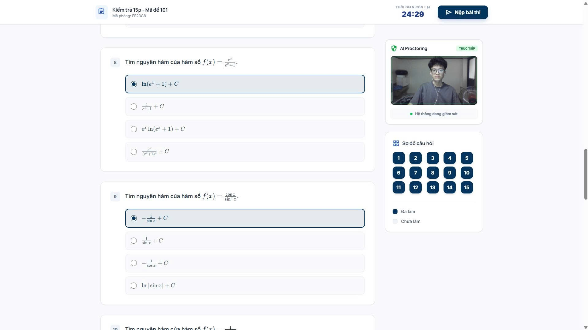
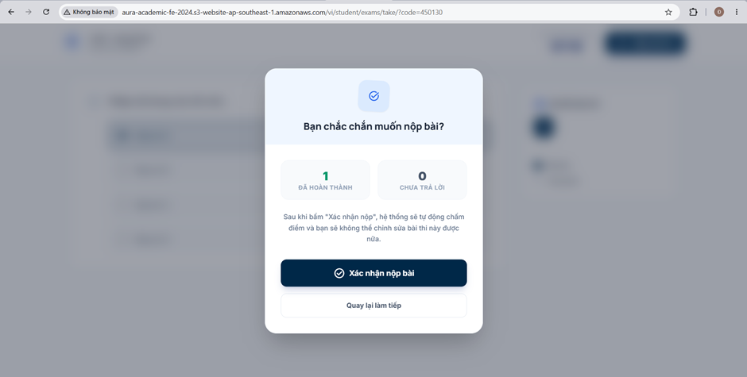
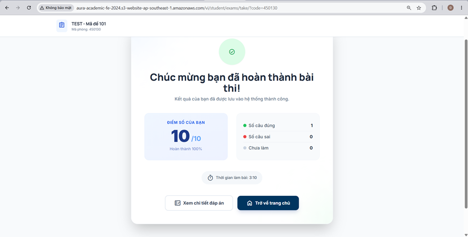

# Tổng quan Giao diện Dashboard & Luồng Thi trực tuyến

Phần này giới thiệu giao diện chính (Dashboard) và trải nghiệm tham gia thi trực tuyến dành cho học viên trên nền tảng **Aura Academic**.

---

### 1. Giao diện Bảng điều khiển (Dashboard)

**Hình 5.1. Giao diện Dashboard của hệ thống**

**Điểm nổi bật của Dashboard:**
- **Thống kê tổng quan (Stats Cards):** Hiển thị nhanh Điểm trung bình, Số bài thi đã nộp, Lớp đang theo học và Lượt luyện tập.
- **Truy cập nhanh phòng thi:** Ô nhập mã bài thi (ví dụ: `AURA25`) cho phép học viên xác thực và vào thi ngay lập tức mà không cần qua nhiều bước tìm kiếm.
- **Dữ liệu học tập tổng hợp:** Theo dõi kết quả các bài thi gần đây, tiến độ hoàn thành và danh sách lớp học đang tham gia.

---

### 2. Trang Thi trực tuyến & Xác thực mã phòng thi

**Hình 5.2. Giao diện Trang thi trực tuyến của hệ thống**

**Hình 5.3. Giao diện nhập mã phòng thi của hệ thống**

**Hình 5.3b. Giao diện phòng chờ kiểm tra & giám sát Camera bằng AI YOLO (YOLO Proctoring V1.0)**

**Chức năng chính:**
- **Quản lý kỳ thi:** Hiển thị danh sách các kỳ thi đang diễn ra, sắp diễn ra và đã hoàn thành kèm bộ lọc trạng thái rõ ràng.
- **Bảo mật phòng thi & Giám sát AI YOLO:** Hộp thoại nhập mã bảo mật giúp kiểm soát quyền truy cập. Trước khi bắt đầu thi, học viên được đưa vào phòng chờ kiểm tra camera, nơi hệ thống AI Monitoring (YOLO Proctoring V1.0) liên tục giám sát không gian làm bài và gửi cảnh báo vi phạm theo thời gian thực.

---

### 3. Trải nghiệm Làm bài thi & Nộp bài

**Hình 5.4. Giao diện sau khi nhấn làm bài thi của hệ thống**

**Hình 5.5. Giao diện làm bài thi của hệ thống**

**Hình 5.6. Giao diện xác nhận nộp bài thi của hệ thống**

**Hình 5.7. Giao diện hoàn thành bài thi của hệ thống**

**Quy trình làm bài thi trực tuyến:**
- **Không gian làm bài tối ưu:** Màn hình chia bố cục khoa học gồm nội dung câu hỏi trắc nghiệm/tự luận và bảng điều hướng câu hỏi bên phải.
- **Đồng hồ đếm ngược & Tự động nộp:** Đếm ngược thời gian thực, tự động lưu đáp án và tự động nộp bài khi hết giờ để bảo vệ kết quả của học viên.
- **Chấm điểm & Tổng kết tức thì:** Hộp thoại xác nhận trước khi nộp, sau đó hiển thị ngay tổng kết điểm số, thời gian hoàn thành và tỉ lệ câu đúng/sai.
