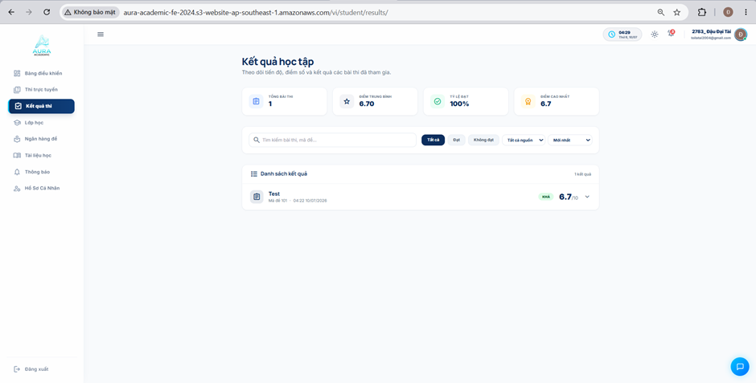
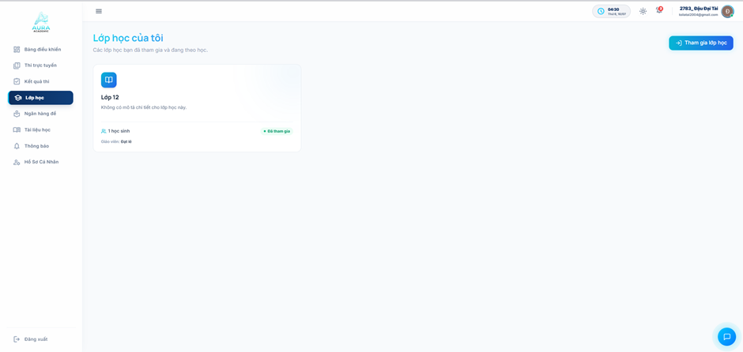
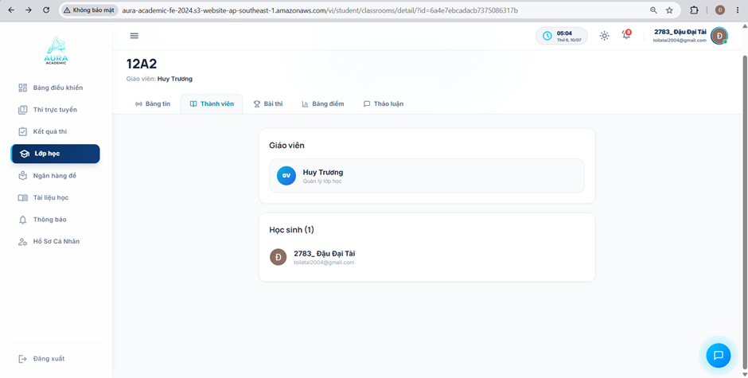
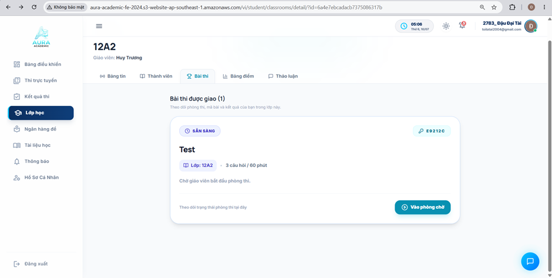
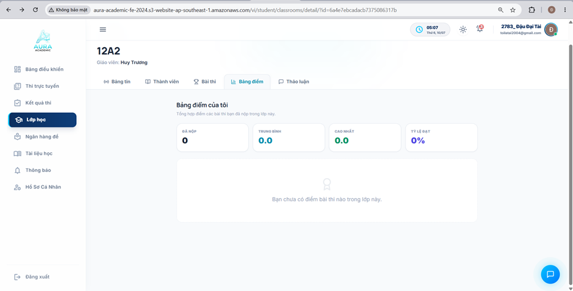
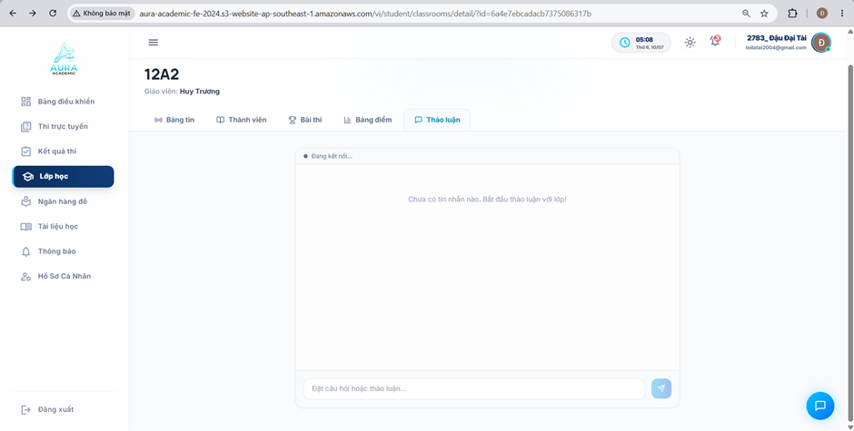

# Quản lý Kết quả học tập & Không gian Lớp học

Phần này giới thiệu các tính năng theo dõi lịch sử kết quả thi và không gian tương tác trong từng lớp học của học viên trên nền tảng **Aura Academic**.

---

### 1. Trang Quản lý Kết quả thi & Lịch sử học tập

**Hình 5.1. Giao diện trang Kết Quả thi của hệ thống**

**Tính năng chính:**
- **Thống kê tổng quan:** Hiển thị tức thì Tổng số bài thi đã tham gia, Điểm trung bình, Tỷ lệ đạt và Điểm số cao nhất từng đạt được.
- **Bộ lọc & Tìm kiếm nhanh:** Bộ lọc đa năng theo từ khóa (Mã đề, Tên kỳ thi), Trạng thái (Đạt / Không đạt) và Nguồn bài thi giúp học viên dễ dàng tra cứu.
- **Chi tiết kết quả bài làm:** Mỗi dòng kết quả cho phép mở rộng để xem chi tiết thời gian làm bài, điểm số và nhãn đánh giá xếp loại.

---

### 2. Tổng quan & Quản lý Lớp học

**Hình 5.2. Giao diện trang Lớp học của hệ thống**

**Hình 5.3.  Giao diện trang thành viên lớp học của hệ thống**

**Chức năng chính:**
- **Danh sách & Ghi danh lớp học:** Hiển thị trực quan các thẻ lớp học đang tham gia với thông tin giáo viên phụ trách và sĩ số. Nút "Tham gia lớp học" hỗ trợ ghi danh vào lớp mới bằng mã lớp.
- **Quản lý danh sách thành viên:** Xem thông tin giáo viên giảng dạy và danh sách bạn học cùng lớp trong không gian kết nối chuyên nghiệp.

---

### 3. Bài tập, Bảng điểm & Thảo luận trong Lớp học

**Hình 5.4.  Giao diện phần bài thi được giao cho lớp học của hệ thống**

**Hình 5.5.  Giao diện phần bảng điểm của lớp học của hệ thống**

**Hình 5.6.  Giao diện phần thảo luận của lớp học của hệ thống**

**Hoạt động chuyên sâu bên trong Lớp học:**
- **Bài thi & Bài tập được giao:** Thống kê danh sách bài kiểm tra dành riêng cho lớp, phân rõ hạn nộp và tình trạng hoàn thành.
- **Bảng điểm minh bạch:** Cập nhật bảng điểm chi tiết của từng bài kiểm tra, giúp học viên tự theo dõi tiến bộ của bản thân theo từng môn học/lớp học.
- **Diễn đàn Thảo luận (Q&A):** Không gian tương tác trực tiếp giúp học viên đặt câu hỏi, trao đổi kiến thức với giáo viên và các bạn học ngay trong lớp.
