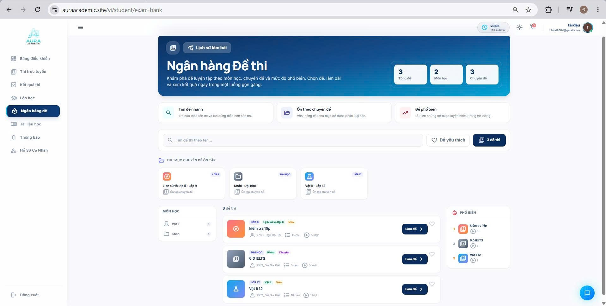
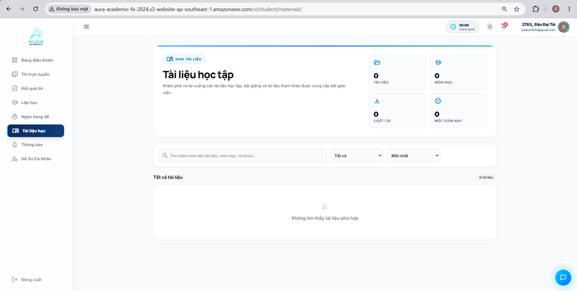
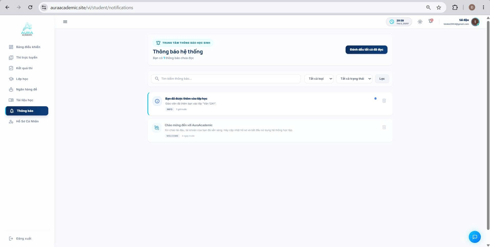
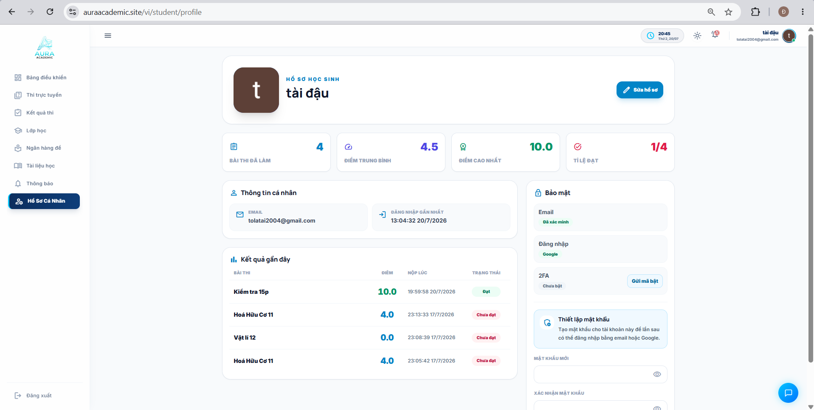

# Question Bank, Study Materials, Notifications & Profile

This section introduces the self-practice question repository, digital library, notification system, and account management tools for students on **Aura Academic**.

---

### 1. Question Bank & Self-Practice Repository

**Figure 5.1. Question Bank Page Interface**

**Key Features:**
- **Diverse Practice Repository:** Provides thousands of practice tests systematically categorized across 23 subjects and specific academic topics.
- **Smart Filtering & Search:** Quick filters for "Favorite Tests", "Popular Tests", "Topic-based Practice", along with instant keyword search.
- **Exam Cart & Practice History:** Students can bookmark tests into a personal cart for later practice and review their past self-practice scores and analytics directly from the main banner.

---

### 2. Study Materials Library

**Figure 5.2. Study Materials Page Interface**

**Key Features:**
- **Digital Learning Resources:** Houses lecture notes, presentation slides, reference documents, and e-books shared by instructors and school administrators.
- **Preview & Instant Download:** Supports directly previewing documents inside the browser or downloading files for offline review anytime.

---

### 3. System Notification Center

**Figure 5.3. Notifications Page Interface**

**Key Features:**
- **Real-Time Updates:** Receives instant alerts regarding upcoming exam schedules, newly assigned classroom exercises, newly released grades, and administrative announcements.
- **Categorized Feeds:** Tabs help filter notifications by "Unread", "Classroom Alerts", or general "System Announcements".

---

### 4. Personal Profile Management

**Figure 5.4. User Profile Page Interface**

**Key Features:**
- **Personal Information:** View and update student name, student ID, profile picture (Avatar), registered email address, and personal contact details.
- **Security & Account Settings:** Change password and monitor login history to ensure comprehensive account security.