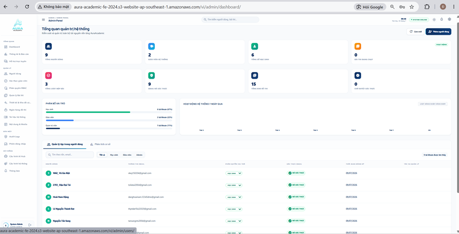
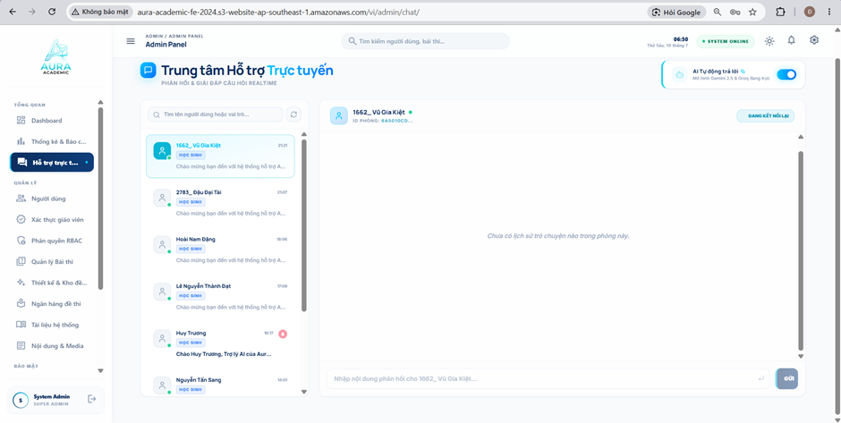
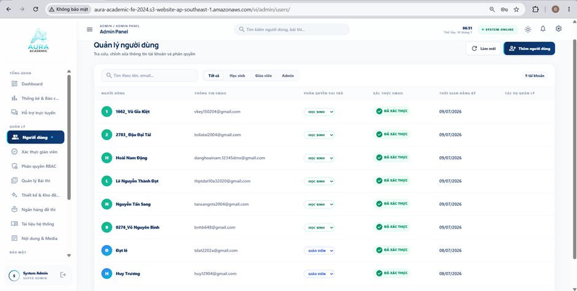
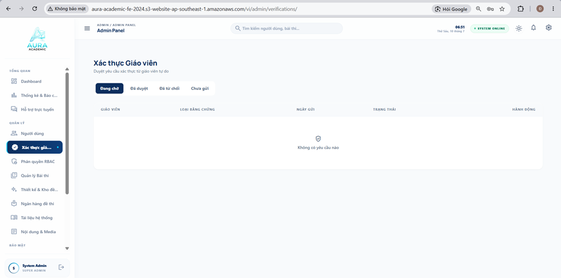

#### 5. Overview of the dashboard statistics and reporting pages, and the classroom pages of the system when logged in with an admin account:

**Figure 5.1. Admin dashboard overview**

#### 5.1.1 Description of Figure 5.1
1. Top Header Area
 * Displayed information:
	 * Area title: "ADMIN / ADMIN PANEL".
	 * Real-time status and system state: "SYSTEM ONLINE" (with a green dot indicating the system is operating normally).
 * Interactive elements:
	 * Global Search: Used to quickly search for users, exams, and other items across the system.
	 * Theme button (sun icon): Switches between Light and Dark modes.
	 * Notification button (bell icon): Opens system alerts, logs, or new notifications.
	 * Account button (avatar at the top right): Quickly accesses the Admin's personal settings.
2. Left Sidebar Menu Area
 * Displayed information:
	 * Aura Academic project logo.
	 * Section headings: OVERVIEW, MANAGEMENT, SECURITY, SYSTEM.
	 * Admin account information at the bottom (avatar and the text "System Admin").
 * Interactive elements:
	 * Navigation tabs: There are many deeper workflow tabs such as Users, RBAC, Exam Management, Question Bank, Audit Logs, AI Hub Configuration, etc. At this moment, the Dashboard tab is selected (Active).
	 * Collapse/Expand Sidebar button (if available, usually near the logo or the bottom avatar icon).
3. Page Header & Quick Actions Area
 * Displayed information:
	 * Main title: "System Administration Overview".
	 * Subtitle: "Monitor and manage all AuraAcademic platform resources".
 * Interactive elements:
	 * "Refresh" button (refresh icon): Calls the API again and updates the latest statistics without reloading the entire page.
	 * "+ Add User" button (dark blue): Usually opens a modal dialog or navigates to a form page for creating a new account (Student/Teacher/Admin).
4. Summary Stats Cards Area
 * Displayed information: Includes 8 critical data cards for the system:
	 * Total users: 9
	 * System teachers: 2
	 * Total students: 6
	 * Active exams: 0
	 * Total submissions: 3
	 * Verified emails: 9
	 * Total question banks: 15
	 * Pending verifications: 0
 * Interactive elements: Normally, the admin dashboard allows direct clicking on each card to navigate to the corresponding list page (for example, clicking "Pending verifications" opens the list of users waiting for approval).
5. Charts & Graphs Area
 * Displayed information:
	 * Role distribution: A horizontal progress bar showing the percentage of the 3 groups: Students (67%), Teachers (22%), Administrators (11%).
	 * System activity over the last 7 days: A container prepared to render a chart (line chart or bar chart) by weekday.
 * Interactive elements:
	 * Dropdown "Daily logins": Located in the System Activity panel. Clicking it opens options to switch chart filters (for example, to view exam attempts or submissions).
6. Data Table Area (User Management)
 * Displayed information:
	 * Sub-tabs: "Centralized User Management" (Active) and "Base Analysis".
	 * Filter summary text: "9 accounts found".
	 * Data table columns: User, Email Information, Role, Email Verification, Registration Time, Management Actions.
	 * Green status label: "Verified".
 * Interactive elements:
	 * Internal search box: "Search by name, email...".
	 * Quick filter pills: All, Student, Teacher, Admin.
	 * "Role assignment" dropdown: (currently showing "Student" with a downward arrow). Admin can click it to change the user role directly in the table without opening a detail page.
	 * Management actions: (This area is hidden/not visible in the screenshot, but in the workshop you can mention that this is where actions such as Edit, Delete, or Ban/Block would be placed).

--------------------------------------------------------------------------------------------------------------

**Figure 5.2. Statistics and reports page**

#### 5.1.2 Description of Figure 5.2
1. Top Header Area
 * Displayed information:
	 * Area title: "ADMIN / ADMIN PANEL".
	 * Real-time time: "06:50 Friday, July 10".
	 * System status: "SYSTEM ONLINE" label (with a green dot).
 * Interactive elements:
	 * Menu button (hamburger icon): Collapses/expands the Sidebar.
	 * Search box: "Search users, exams..." with a magnifying-glass icon.
	 * Theme button (sun icon): Switches Light/Dark mode.
	 * Notification button (bell icon): Opens system notifications.
	 * Settings button (gear icon): Quick access to system configuration (this is a new element compared with the student interface).
	 * Account button (avatar with the letter Đ): Opens the account shortcut menu.
2. Left Sidebar Menu Area
 * Displayed information:
	 * Aura Academic logo.
	 * Functional groups: OVERVIEW, MANAGEMENT, SECURITY (partially hidden).
	 * Scrollbar: Indicates the menu continues further down.
	 * Bottom account info: "System Admin - SUPER ADMIN".
 * Interactive elements:
	 * Navigation tab list: The "Statistics & Reports" tab is selected (Active - dark blue, with a chart icon). Other tabs include Dashboard, Online Support, Users, Teacher Verification, RBAC, Exam Management, Design & Question Bank, Question Bank, System Documents, and Content & Media.
	 * Logout button (arrow-out icon): Located next to the System Admin information at the bottom.
3. Page Header Area
 * Displayed information:
	 * Main title: "Statistics & Reports".
	 * Subtitle: "System statistics data - updated in real time".
 * Interactive elements:
	 * "Refresh" button: Uses a rotating-arrow icon to call the API and update the latest data on the page.
4. Summary Cards Area
 * Displayed information: Includes 4 cards with the following titles:
	 * Total users (people icon).
	 * Total exams (quiz icon).
	 * Submissions (completion check icon).
	 * Verified emails (badge check icon).
	 * UI/UX note for testing: These 4 cards are currently not showing numeric data (they may be in a loading state or missing API data). This is worth highlighting during the workshop demo.
 * Interactive elements: Depending on the design, these cards may be clickable and navigate to the corresponding detail list page.
5. Charts & Detailed Analytics Area
 * "7-day logins" panel:
	 * Displayed information: The text "Sample data" appears faintly on the right. Below it are numbers (38, 62, 55...) corresponding to weekdays (Mon, Tue, Wed... Sun). This area is waiting for a line or bar chart to render.
 * "User distribution" panel:
	 * Displayed information:
		 * Progress bars show the ratio of Students (6), Teachers (2), and Admins (1).
		 * Additional indicators below: Verified emails, Locked accounts (0 - red), Active exams (0 - green).
	 * Interactive elements: This area is primarily for data visualization and usually has no direct interactive buttons.
6. Status Area (System Alerts)
 * Displayed information:
	 * Title: "System alerts".
	 * Notification panel (light jade background): Includes a check icon and the text "The system is operating normally".
 * Interactive elements: None. This is a UI component used to communicate server/system health status.

--------------------------------------------------------------------------------------------------------------

**Figure 5.3. Online support center page**

#### 5.1.3 Description of Figure 5.3
1. Top Header Area
 * Displayed information:
	 * Area title: "ADMIN / ADMIN PANEL".
	 * Real-time time: "06:50 Friday, July 10".
	 * Status label: "SYSTEM ONLINE" (with a green dot).
 * Interactive elements:
	 * Menu button (hamburger icon): Collapses/expands the Sidebar.
	 * Global search: "Search users, exams...".
	 * Utility icons: Theme (Light/Dark), Notifications (bell), Settings (gear), and the Admin account avatar.
2. Left Sidebar Menu Area
 * Displayed information:
	 * Aura Academic logo.
	 * Group labels: OVERVIEW, MANAGEMENT, SECURITY.
	 * Bottom account info: "System Admin - SUPER ADMIN".
 * Interactive elements:
	 * Navigation tabs: The "Support center..." tab is selected (Active - dark blue). You can also see the scrollbar, indicating more menu items below.
	 * Logout button: Located next to the Admin info at the bottom.
3. Page Header & AI Configuration Area
 * Displayed information:
	 * Main title: "Online Support Center" (with a chat-bubble icon).
	 * Subtitle: "REAL-TIME QUESTIONS & FEEDBACK".
	 * AI configuration box: The text "Auto reply AI" and the smaller description "Gemini 2.5 & Groq models are active".
 * Interactive elements:
	 * Toggle switch: Located in the AI configuration box, currently ON (green). It is used to enable or disable the AI bot that automatically answers student questions.
4. Conversation List Area (Left Column)
 * Displayed information:
	 * A list of user conversation cards: showing Name (for example, 1662_ Vũ Gia Kiệt, 2783_ Đậu Đại Tài...), Role (STUDENT), Last message time (21:21, 21:07...), and a preview of the latest message.
	 * Online/Offline status: Green dot (Online) or gray dot (Offline) next to the avatar. "Huy Trương" also has a red unread-message notification icon.
 * Interactive elements:
	 * Conversation search box: "Search by username or role..." for quickly filtering the person to chat with.
	 * Refresh button (refresh icon): Updates the latest message list.
	 * Chat cards: Clicking a card (for example, the active card for Vũ Gia Kiệt with a blue border) opens the conversation details in the right panel.
5. Chat Window Area (Right Column)
 * Displayed information:
	 * Header: Shows the avatar, the active user's name ("1662_ Vũ Gia Kiệt"), online indicator, and room ID "ROOM ID: 6A5010CD...".
	 * Main body: Empty-state text "There is no chat history in this room yet."
 * Interactive elements:
	 * "RECONNECTING" button/label: Located at the top right of the chat window. It usually indicates the socket connection status for that chat room.
	 * Message input field: Located at the bottom, with placeholder text "Enter a reply for 1662_ Vũ Gia Kiệt...".
	 * "SEND" button: Sends the message. Placed right next to the input field.

--------------------------------------------------------------------------------------------------------------

**Figure 5.4. User management page**

#### 5.1.4 Description of Figure 5.4
1. Top Header Area
 * Displayed information:
	 * Title: "ADMIN / ADMIN PANEL".
	 * Real-time time: "06:51 Friday, July 10".
	 * System status: "SYSTEM ONLINE" label (with a green dot).
 * Interactive elements:
	 * Menu button (hamburger icon): Collapses/expands the Sidebar.
	 * Global search: "Search users, exams...".
	 * Utility icons: Theme (Light/Dark), Notifications (bell), Settings (gear), and the Admin avatar.
2. Left Sidebar Menu Area
 * Displayed information:
	 * Aura Academic logo.
	 * Functional groups: OVERVIEW, MANAGEMENT, SECURITY.
	 * Bottom account info: "System Admin - SUPER ADMIN".
 * Interactive elements:
	 * Navigation tab: The "Users" tab is selected (Active - dark blue).
	 * Logout button: Arrow-out icon placed next to the Admin info at the bottom.
3. Page Header & Main Actions Area
 * Displayed information:
	 * Main title: "User Management".
	 * Subtitle: "Search, edit account information, and assign roles".
 * Interactive elements:
	 * "Refresh" button: Calls the API to reload the latest table data.
	 * "+ Add User" button (dark blue): Click to open a form/modal for creating a new account.
4. Search and Filter Area
 * Displayed information:
	 * Total record counter: "9 accounts" (shown on the right).
 * Interactive elements:
	 * Search box: "Search by name, email..." for typing a specific user keyword.
	 * Role filter pills: "All" (active), "Student", "Teacher", "Admin". Click each one to quickly filter the list below by user group.
5. Data Table Area
 * Displayed information:
	 * Table columns: USER, EMAIL INFORMATION, ROLE, EMAIL VERIFICATION, REGISTRATION TIME, MANAGEMENT ACTIONS.
	 * Row data: Shows avatar initials, user code/name (for example, 1662_ Vũ Gia Kiệt), email, and registration date (09/07/2026).
	 * Status label: "VERIFIED" (green) indicating the email has been verified.
 * Interactive elements:
	 * "Role assignment" dropdown: (buttons showing "STUDENT" with a green border or "TEACHER" with a blue border and a downward arrow). Admin can click directly here to change the user's role immediately without opening a detail page.
	 * "Management actions" column: The UI in this column is currently empty (possibly unfinished or hidden icons). Normally this area would contain important actions such as Edit, Delete, or Ban/Block. This is a useful point to mention when presenting the workshop.

--------------------------------------------------------------------------------------------------------------

**Figure 5.5. Teacher verification page**

#### 5.1.5 Description of Figure 5.5
1. Top Header Area
 * Displayed information:
	 * Area title: "ADMIN / ADMIN PANEL".
	 * Real-time time: "06:51 Friday, July 10".
	 * System status: "SYSTEM ONLINE" label (with a green dot).
 * Interactive elements:
	 * Menu button (hamburger icon): Collapses/expands the Sidebar.
	 * Global search box: "Search users, exams...".
	 * Utility icons at the top right: Theme (Light/Dark), Notifications (bell), Settings (gear), and the Admin avatar.
2. Left Sidebar Menu Area
 * Displayed information:
	 * Aura Academic project logo.
	 * Section headings: OVERVIEW, MANAGEMENT, SECURITY.
	 * Scrollbar showing the menu list continues further down.
	 * Bottom account info: "System Admin - SUPER ADMIN" with an "S" avatar.
 * Interactive elements:
	 * Navigation tabs: The "Teacher verification" tab (truncated as "Teacher ver...") is selected (Active - dark blue).
	 * Logout button: Arrow-out icon located at the bottom right of the Admin info area.
3. Page Header & Status Filters Area
 * Displayed information:
	 * Main title: "Teacher Verification".
	 * Subtitle: "Review verification requests from freelance teachers".
 * Interactive elements:
	 * Status filter tabs: "Pending" (currently active with a dark blue background), "Approved", "Rejected", and "Not submitted". Clicking a tab will call the API and display the verification requests for that status.
4. Data Table Area
 * Displayed information:
	 * Table columns: TEACHER, PROOF TYPE, SUBMISSION DATE, STATUS, ACTION.
	 * Empty state: Because the "Pending" tab currently has no data, the table shows a large empty area with a shield-check icon in the middle and the text "No requests found".
 * Interactive elements:
	 * The table is empty, so no interactive buttons are currently shown. However, during the presentation you can explain that if there is data, the "ACTION" column would usually include buttons such as "View details", "Approve", or "Reject" with a reason.

--------------------------------------------------------------------------------------------------------------

**Figure 5.6. RBAC page**

#### 5.1.6 Description of Figure 5.6
1. Top Header Area
 * Displayed information:
	 * Area title: "ADMIN / ADMIN PANEL".
	 * Real-time time: "06:52 Friday, July 10".
	 * System status: "SYSTEM ONLINE" label (with a green dot).
 * Interactive elements:
	 * Menu button (hamburger icon): Collapses/expands the Sidebar.
	 * Global search box: "Search users, exams...".
	 * Utility icons at the top right: Theme (Light/Dark), Notifications (bell), Settings (gear), and the Admin account avatar.
2. Left Sidebar Menu Area
 * Displayed information:
	 * Aura Academic project logo.
	 * Section headings: OVERVIEW, MANAGEMENT, SECURITY.
	 * Bottom account info: "System Admin - SUPER ADMIN" with an "S" avatar.
 * Interactive elements:
	 * Navigation tab: The "RBAC" tab is selected (Active - dark blue, with a security lock icon).
	 * Logout button: Arrow-out icon located at the bottom right.
3. Page Header Area
 * Displayed information:
	 * Main title: "RBAC".
	 * Subtitle: "Customize roles and the system permission matrix. Changes are saved locally."
 * Interactive elements: No quick action buttons are shown in this area.
4. Role & Permission Cards Area
 * Displayed information: Includes 3 cards representing the 3 main permission groups in the system, each with a distinct color strip at the top:
	 * Administrator card (purple strip): Shows "1 user". The checked permissions include: User Management, Exam Management, View exam results, System Configuration, View Audit Logs. The "Take exam" permission is grayed out (not granted).
	 * Teacher card (blue strip): Shows "2 users". The checked permissions include: Exam Management, View exam results. Other permissions are grayed out.
	 * Student card (green strip): Shows "6 users". The checked permission includes: Take exam. Other permissions are grayed out.
 * Interactive elements:
	 * Checkboxes: On the overview screen, these boxes are read-only and only display the current state.
	 * "Edit permissions" button: Located at the bottom of each card. When the Admin clicks it, the system usually opens a modal or switches the checkboxes above into an editable state so the Admin can change the permissions for that role group and then click "Save".