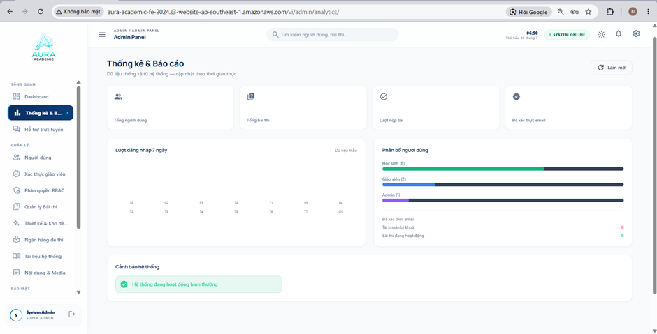
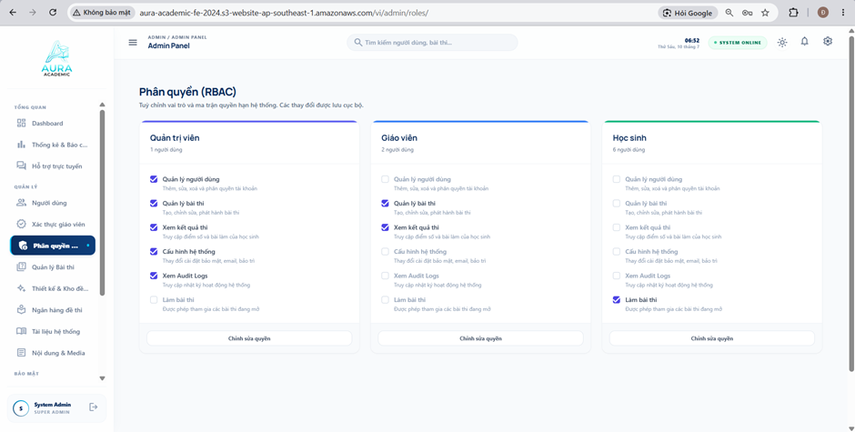

# Admin Dashboard, Statistics Reports & User Management

This section introduces the administrative overview (Admin Dashboard), detailed statistical reporting system, and comprehensive user account management tools on **Aura Academic**.

---

### 1. Administrative Overview Dashboard

**Figure 5.1. Admin Dashboard Interface**

**Key Features:**
- **System-Wide Control:** Provides an executive overview of platform activity: Total Active Users, Ongoing Examinations, System Load, and Newly Created Classrooms.
- **Visual Analytics:** Real-time charts displaying traffic trends and resource utilization across different timeframes.

---

### 2. In-Depth Statistics & Reports

**Figure 5.2. Statistics & Reports Page Interface**

**Key Features:**
- **Academic Performance Analytics:** Aggregates score distribution charts across entire schools/exams, test completion rates, and most popular subject categories.
- **Periodic Report Export:** Supports exporting structured data into Excel/PDF formats for institutional quality assessment and auditing.

---

### 3. Online Support Center

**Figure 5.3. Online Support Center Page Interface**

**Key Features:**
- **Ticket Reception & Resolution:** Manages incoming support requests (Tickets/Live Chat) from students and instructors experiencing technical issues during study sessions or exams.
- **Support Status Tracking:** Categorizes tickets by urgency levels and workflow status (Pending, In Progress, Resolved).

---

### 4. User Account Management

**Figure 5.4. User Management Page Interface**

**Key Features:**
- **Comprehensive Account Directory:** Displays full listings of students, teachers, and staff members, complete with advanced search and role-based filtering.
- **Quick Account Actions:** Supports manual creation, bulk Excel imports, account locking/unlocking, and password resets as needed.

---

### 5. Teacher Verification & Approval

**Figure 5.5. Teacher Verification Page Interface**

**Key Features:**
- **Credential Review:** Administrators review teaching credentials, certificates, and submitted registration documents before granting classroom creation privileges.
- **Approve or Reject Workflows:** Quick action buttons allow immediate approval of valid applications or requests for additional documentation.

---

### 6. Role & Permission Management

**Figure 5.6. Role & Permission Page Interface**

**Key Features:**
- **Security Role Definition:** Establishes granular role groups (Student, Teacher, Content Admin, Super Admin).
- **Fine-Grained Permissions:** Configures exact operational privileges (Create Exam, Delete User, View Reports) per role group to maintain maximum system security.