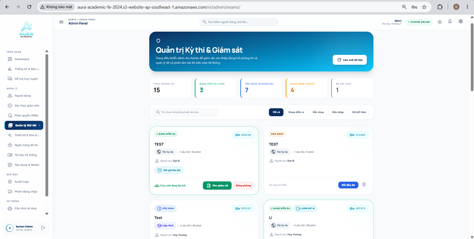
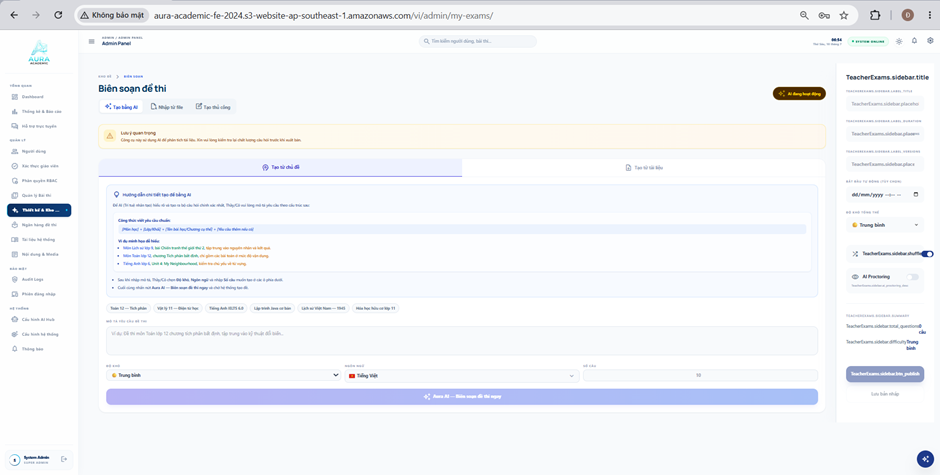
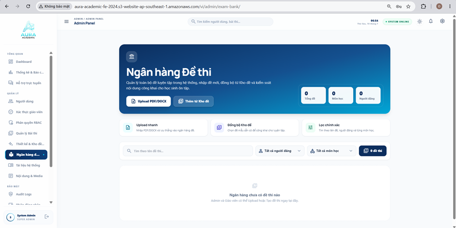
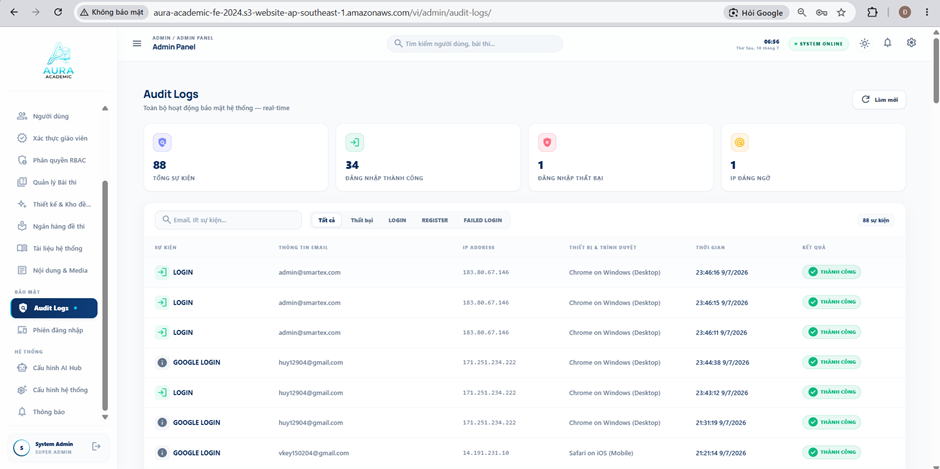
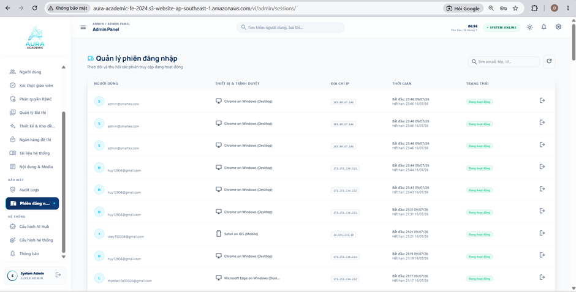

# Quản trị Kỳ thi, Biên soạn Đề, Tài liệu & Nhật ký Hệ thống

Phần này giới thiệu chuyên sâu về công cụ quản lý kỳ thi quy mô lớn, trình biên soạn đề thi, kho tài liệu/media và hệ thống nhật ký giám sát (Audit Logs) dành cho Quản trị viên trên **Aura Academic**.

---

### 1. Quản trị Kỳ thi & Báo cáo Tổng thể

**Hình 5.1. Giao diện trang Quản trị kỳ thi và báo cáo của hệ thống**

**Chức năng chính:**
- **Thiết lập kỳ thi tập trung:** Tạo, cấu hình thời gian mở/đóng, mật khẩu phòng thi và phân bổ đề thi cho các kỳ thi cấp trường hoặc cấp toàn hệ thống.
- **Giám sát & Thống kê kỳ thi:** Theo dõi số lượng học viên đang làm bài theo thời gian thực và xem báo cáo tổng kết chi tiết ngay khi kỳ thi kết thúc.

---

### 2. Trình Biên soạn Đề thi Nâng cao

**Hình 5.2. Giao diện trang Biên soạn đề thi của hệ thống**

**Chức năng chính:**
- **Soạn thảo đa định dạng:** Trình soạn thảo trực quan cho phép tạo câu hỏi trắc nghiệm (Single/Multi choice), câu hỏi tự luận, chèn công thức Toán học (LaTeX) và hình ảnh minh họa.
- **Cấu hình đáp án & Giải thích:** Nhập đáp án đúng và lời giải chi tiết giúp tự động hóa quá trình chấm điểm và phản hồi cho học viên.

---

### 3. Quản trị Ngân hàng Đề thi Chung

**Hình 5.3. Giao diện trang Ngân hàng đề thi của hệ thống**

**Chức năng chính:**
- **Phân cấp câu hỏi:** Phân loại đề thi theo bộ môn, khối lớp và mức độ khó (Nhận biết, Thông hiểu, Vận dụng, Vận dụng cao).
- **Import/Export đề thi:** Tải lên hàng loạt câu hỏi từ file Word/Excel chuẩn hóa, giúp tiết kiệm tối đa thời gian xây dựng kho đề.

---

### 4. Quản lý Tài liệu Học tập & Giáo trình

**Hình 5.4. Giao diện trang Quản lý tài liệu của hệ thống**

**Chức năng chính:**
- **Khởi tạo & Phân phối tài nguyên:** Đăng tải giáo trình, sách điện tử và tài liệu tham khảo chính thống lên thư viện chung.
- **Phân quyền truy cập tài liệu:** Cấu hình tài liệu nào được xem công khai hoặc chỉ lưu hành nội bộ cho từng khối lớp/nhóm giáo viên.

---

### 5. Quản lý Nội dung & Kho Media (Files & Media)

**Hình 5.5. Giao diện trang Nội dung & Media của hệ thống**

**Chức năng chính:**
- **Quản lý tập tin tập trung:** Hệ thống quản lý hình ảnh, video bài giảng và tệp đính kèm được sử dụng trên toàn hệ thống.
- **Tối ưu hóa dung lượng:** Kiểm tra dung lượng lưu trữ, dọn dẹp các tệp tin tạm và đảm bảo tốc độ tải trang nhanh chóng.

---

### 6. Nhật ký Hệ thống (Audit Logs)

**Hình 5.6. Giao diện trang Audit Logs của hệ thống**

**Chức năng chính:**
- **Ghi nhận lịch sử thao tác:** Lưu lại mọi hành động quan trọng trên hệ thống: Ai đã xóa người dùng, ai đã sửa điểm thi hay thay đổi cấu hình bảo mật.
- **Truy vết & Khắc phục sự cố:** Đảm bảo tính minh bạch, hỗ trợ quản trị viên dễ dàng điều tra nguồn gốc khi xảy ra sai sót dữ liệu.

---

### 7. Quản lý Phiên Đăng nhập (User Sessions)

**Hình 5.7. Giao diện trang Quản lý phiên đăng nhập của hệ thống**

**Chức năng chính:**
- **Giám sát thiết bị kết nối:** Danh sách các thiết bị và địa chỉ IP đang đăng nhập vào hệ thống theo thời gian thực.
- **Chấm dứt phiên bất thường:** Thu hồi quyền truy cập (Đăng xuất từ xa) đối với các tài khoản có dấu hiệu nghi vấn hoặc đăng nhập trên thiết bị lạ.
