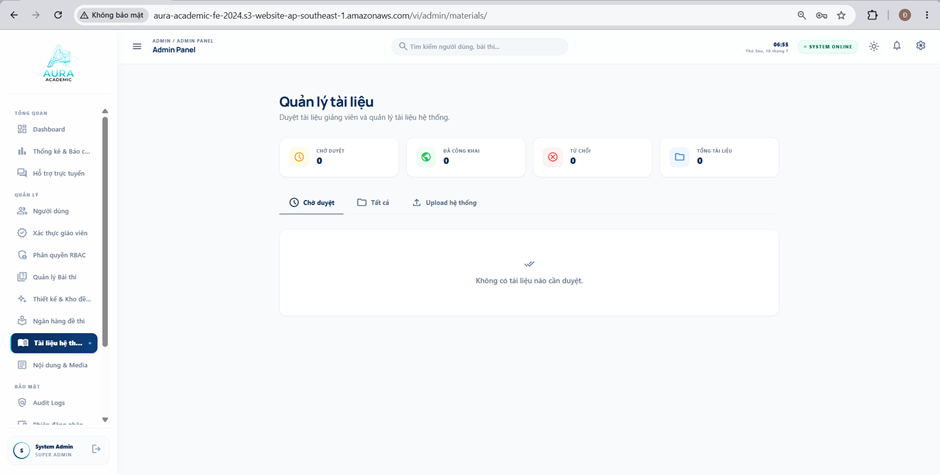
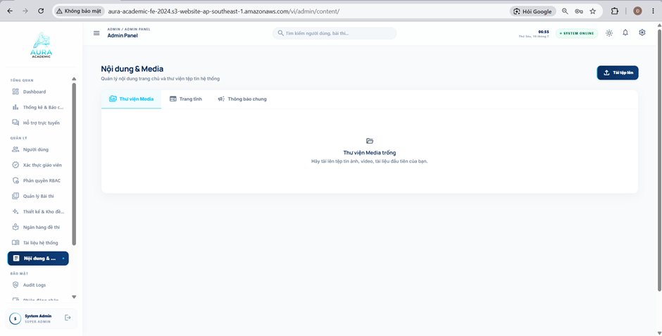

#### 5. Overview of the exam administration and reporting page, the exam authoring page, and the class page of the system when logged in with an admin account:

**Figure 5.1. The system's exam administration and reporting page**

#### 5.1.1 Description of Figure 5.1
1. Top navigation area (Top Header)
 * Display information:
	 * Section title: "ADMIN / ADMIN PANEL".
	 * Real-time clock and system status: "SYSTEM ONLINE" (with a green dot indicating normal system operation).
 * Interactive controls:
	 * Global Search field: Used to quickly search users, exams, and other items across the system.
	 * Theme button (sun icon): Switches between light and dark modes.
	 * Notification button (bell icon): Views system warnings, logs, or new notifications.
	 * Account button (avatar in the top-right corner): Provides quick access to the Admin's personal settings.
2. Left-side function menu (Admin Sidebar)
 * Display information:
	 * Aura Academic project logo.
	 * Functional group headings: OVERVIEW, MANAGEMENT, SECURITY, SYSTEM.
	 * Admin account information displayed at the bottom (avatar and the text "System Admin").
 * Interactive controls:
	 * Navigation tabs: There are many deeper business tabs such as Users, RBAC Permissions, Exam Management, Question Bank, Audit Logs, AI Hub Configuration... At this moment the Dashboard tab is selected (Active).
	 * Sidebar Collapse/Expand button (if available, usually located near the logo or the avatar icon at the bottom).
3. Page title and quick actions area (Page Header & Actions)
 * Display information:
	 * Main title: "System Administration Overview".
	 * Subtitle: "Control and manage all platform resources of AuraAcademic".
 * Interactive controls:
	 * "Refresh" button (refresh icon): Click to call the API and update the latest statistics without reloading the whole website.
	 * "+ Add user" button (dark blue button): Usually opens a modal popup or navigates to a form page for creating a new account (Student/Teacher/Admin).
4. Overview statistics cards (Summary Stats Cards)
 * Display information: Includes 8 vital system metric cards:
	 * Total users: 9
	 * System teachers: 2
	 * Total students: 6
	 * Exams running: 0
	 * Total submissions: 3
	 * Verified emails: 9
	 * Total exam bank items: 15
	 * Waiting for verification approval: 0
 * Interactive controls: In a typical admin dashboard, these cards can often be clicked to navigate quickly to the corresponding list page (for example, clicking "Waiting for verification approval" opens the user approval list).
5. Analytics area (Charts & Graphs)
 * Display information:
	 * Role distribution: Presented as horizontal progress bars showing the percentage of 3 groups: Students (67%), Teachers (22%), Administrators (11%).
	 * System activity over the last 7 days: A placeholder area for a chart (line chart or bar chart) by weekday.
 * Interactive controls:
	 * Dropdown "Daily logins": Located in the system activity panel. Click it to open options and change the chart filter (for example, switch to exam attempts or submissions).
6. Data table area (Data Table - User management)
 * Display information:
	 * Secondary tabs: "Centralized user management" (Active) and "Base analysis".
	 * Filter summary text: "9 accounts found".
	 * Data table columns: User, Email information, Role assignment, Email verification, Registration time, Management actions.
	 * Green status badge: "Verified".
 * Interactive controls:
	 * Internal search input: "Search by name, email...".
	 * Quick filter pills: All, Students, Teachers, Admin.
	 * Dropdown "Role assignment": (Currently showing the text "Student" with a downward arrow). The Admin can click here to change a user's role directly in the table without opening the detail page.
	 * Management actions: (This area is currently hidden/has no icon in the image, but in the workshop you can mention that this is where buttons such as Edit, Delete, or Ban/Block would normally be placed).

--------------------------------------------------------------------------------------------------------------

**Figure 5.2. The system's statistics and reports page**

#### 5.1.2 Description of Figure 5.2
1. Top navigation area (Top Header)
 * Display information:
	 * Section title: "ADMIN / ADMIN PANEL".
	 * Real-time clock: "06:50 Friday, July 10".
	 * System status: "SYSTEM ONLINE" badge (with a green dot).
 * Interactive controls:
	 * Menu button (3-line icon): Collapse/expand the sidebar.
	 * Global search field: Search input box with a magnifying-glass icon.
	 * Utility icons: Theme, Notifications, Settings, and Admin avatar.
2. Left-side function menu (Admin Sidebar)
 * Display information: Standard system menu.
 * Interactive controls:
	 * Navigation tabs: The tab "Design & Question Bank" is selected (Active - dark blue background).
	 * Logout button: Located in the bottom-right corner.
3. Page title and question creation toolbar (Page Header & Methods)
 * Display information:
	 * Breadcrumb: "QUESTION BANK > AUTHORING".
	 * Main title: "Exam authoring".
	 * Status badge: A brown/yellow pill button with the text "AI is active", indicating the AI question-generation core is ready.
	 * Warning box (yellow): "Important note: This tool uses AI to analyze documents. Please review the quality of the questions before publishing."
 * Interactive controls:
	 * 3 method tabs for creating exams: * "Create with AI" (Active - blue).
		 * "Import from file" (Click to upload an existing Word/PDF/Excel file).
		 * "Create manually" (Click to open a form for entering questions one by one).
4. Main workspace: Create with AI (AI Prompting Area)
 * Display information:
	 * Instruction panel "Detailed guide for AI exam creation": Provides the standard prompt-writing formula and visual examples for teachers.
 * Interactive controls:
	 * 2 AI data source tabs: "Create from topic" (Active - AI infers automatically) and "Create from document" (May be a RAG feature, allowing the AI to read a private document file and generate questions from it).
	 * Quick suggestion chips: "Math 12 - Integrals", "Physics 11 - Electromagnetism"... Click to quickly fill the description field below.
	 * Text area: "EXAM REQUIREMENT DESCRIPTION". This is where the teacher types the prompt to instruct the AI (for example, a Math 12 exam on chapter...).
	 * Question configuration dropdowns: * DIFFICULTY: Select a level (for example, Medium, Hard, Easy).
		 * LANGUAGE: Select the output language (for example, Vietnamese).
		 * NUMBER OF QUESTIONS: Input the number of questions the AI should generate (currently set to 10).
	 * Main action button (large purple/blue): "Aura AI - Generate exam now". Click to send the request to the AI server and start the generation process.
5. Right-side exam settings panel (Settings Sidebar - UI BUG WARNING)
 * Display information:
	 * This area has a bug and has not loaded the language file correctly (Missing i18n keys). Instead of Vietnamese text, it shows code-like variables such as TeacherExams.sidebar.title, TeacherExams.sidebar.label..., TeacherExams.sidebar.SUMMARY.
 * Interactive controls (Exam setup flow):
	 * Text input fields (broken keys): Likely fields for Exam Name and Exam Description.
	 * Date/time picker: "AUTO START (OPTIONAL)" - Click to schedule an automatic exam room opening time.
	 * Overall difficulty dropdown: Currently set to "Medium".
	 * Shuffle toggle: Enables/disables shuffling the question/answer order (currently showing the key TeacherExams.sidebar.shuffle...).
	 * AI Proctoring toggle: Enables/disables AI-based exam monitoring.
	 * Action button (broken key): Blue button TeacherExams.sidebar.btn_publish (likely "Save and Publish").
	 * "Save draft" button: Saves the current settings without publishing.

--------------------------------------------------------------------------------------------------------------

**Figure 5.3. The system's exam bank page**

#### 5.1.3 Description of Figure 5.3

1. Top navigation area (Top Header)
 * Display information:
	 * Title: "ADMIN / ADMIN PANEL".
	 * Real-time clock: "06:54 Friday, July 10".
	 * System status: "SYSTEM ONLINE" badge (with a green dot).
 * Interactive controls:
	 * Menu button (3-line icon): Collapse/expand the sidebar.
	 * Global search field: Search box "Search users, exams...".
	 * Top-right icons: Theme (Light/Dark), Notifications, Settings, and Admin avatar.
2. Left-side function menu (Admin Sidebar)
 * Display information:
	 * Aura Academic logo.
	 * System function groups.
	 * Bottom account information: "System Admin - SUPER ADMIN".
 * Interactive controls:
	 * Navigation tabs: The tab "Exam Bank" is selected (Active - dark blue background, bank/library-style icon).
	 * Logout button: Located in the bottom-right corner.
3. Main banner and statistics area (Hero Banner & Stats)
 * Display information:
	 * Signature gradient blue background.
	 * Main title: "Exam Bank" (with a building icon).
	 * Description: "Manage all practice exams in the system, import new exams, sync from the question bank, and control public content for student practice." 
	 * 3 mini stat cards: Show summary data "0 Total exams", "0 Subjects", "0 Contributors". (Because the bank is empty, all indicators are 0.)
 * Interactive controls (Main actions):
	 * "Upload PDF/DOCX" button (white background): Opens a form or modal for an Admin/Teacher to upload a document file from their computer.
	 * "Add from question bank" button (light blue outlined background): Lets users select and sync ready-made exams from the "Authoring question bank" into the "Public exam bank" for student practice.
4. Highlight feature cards (Feature Highlight Cards)
 * Display information: 3 cards that briefly describe the page's core features:
	 * "Fast upload": Import PDF/DOCX and save directly to the exam bank.
	 * "Sync question bank": Choose available templates to publish for practice.
	 * "Precise filtering": Search by exam name, contributor, and subject.
 * Interactive controls: These cards can either be informational cards or shortcut buttons that jump directly to the corresponding feature.
5. Search and filter area (Search & Filters)
 * Display information: None.
 * Interactive controls:
	 * Search box: "Search by exam name..." for typing keywords.
	 * Dropdown "All contributors": Filters exams by the teacher/admin who uploaded them.
	 * Dropdown "All subjects": Filters exams by a specific subject (Math, Physics, Chemistry, etc.).
	 * Button/label "0 exams" (dark blue): Acts as the submit button to apply filters, or as the total count after filtering.
6. Data list area / empty state (Data List / Empty State)
 * Display information: * Since there is no data yet, this area is showing a very clear empty state.
	 * Empty document icon.
	 * Title: "The exam bank has no exams yet".
	 * Guidance note: "Admins and Teachers can Upload or Create exams here."
 * Interactive controls: There are currently no buttons, but if data exists, this is where exam cards or a table would appear, along with actions such as View details, Edit, or Delete.

--------------------------------------------------------------------------------------------------------------

**Figure 5.4. The system's document management page**

#### 5.1.4 Description of Figure 5.4
1. Top navigation area (Top Header)
 * Display information:
	 * Section title: "ADMIN / ADMIN PANEL".
	 * Real-time clock: "06:55 Friday, July 10".
	 * System status: "SYSTEM ONLINE" badge (with a green dot).
 * Interactive controls:
	 * Menu button (3-line icon): Collapse/expand the sidebar.
	 * Global search field: Search input box "Search users, exams...".
	 * Top-right icons: Theme (switch light/dark mode), Notifications (bell), Settings (gear), and Admin avatar (letter D).
2. Left-side function menu (Admin Sidebar)
 * Display information:
	 * Aura Academic project logo.
	 * System section headings: OVERVIEW, MANAGEMENT, SECURITY.
	 * Bottom account information: "System Admin - SUPER ADMIN" (with an S-letter avatar).
 * Interactive controls:
	 * Navigation tabs: The tab "System documents" is selected (Active - dark blue background, notebook/document icon).
	 * Logout button: An arrow-out icon located in the bottom-right corner.
3. Page title area (Page Header)
 * Display information:
	 * Main title: "Document management".
	 * Subtitle: "Review teacher documents and manage system documents."
 * Interactive controls: There are no buttons in this area.
4. Status summary cards (Status Summary Cards)
 * Display information: 4 cards summarizing document counts by different statuses (all currently equal to 0):
	 * PENDING REVIEW: 0 (with a yellow clock icon).
	 * PUBLISHED: 0 (with a green globe icon).
	 * REJECTED: 0 (with a red X icon).
	 * TOTAL DOCUMENTS: 0 (with a blue folder icon).
 * Interactive controls: In a real UX, these cards can be clickable and act as quick filters so the Admin can instantly view documents in the corresponding status.
5. Filter tab area (Filter Tabs)
 * Display information: None.
 * Interactive controls:
	 * Tab "Pending review": (Active - dark blue underline). Click to see teacher-uploaded documents waiting for Admin approval.
	 * Tab "All": (With folder icon). Click to view all documents in the system.
	 * Tab "System upload": (With upload icon). Click to open a form/view for the Admin to upload shared documents directly to the system.
6. Data list area / empty state (Data List / Empty State)
 * Display information:
	 * Because the "Pending review" tab currently has no data (count is 0), this area shows an empty state.
	 * Includes a light gray double-check icon and the text: "There are no documents waiting for review." 
 * Interactive controls: There are currently no buttons. If there are documents pending review, this area would show a table or card list with important actions such as Approve, Reject, or Preview the document.

--------------------------------------------------------------------------------------------------------------

**Figure 5.5. The system's content and media page**

#### 5.1.5 Description of Figure 5.5
1. Top navigation area (Top Header)
 * Display information:
	 * Section title: "ADMIN / ADMIN PANEL".
	 * Real-time clock: "06:55 Friday, July 10".
	 * System status: "SYSTEM ONLINE" badge (with a green dot).
 * Interactive controls:
	 * Menu button (3-line icon): Collapse/expand the sidebar.
	 * Global search field: Search input box "Search users, exams...".
	 * Top-right icons: Theme (light/dark mode), Notifications (bell), Settings (gear), and Admin avatar (letter D).
2. Left-side function menu (Admin Sidebar)
 * Display information:
	 * Aura Academic project logo.
	 * Headings for system sections: OVERVIEW, MANAGEMENT, SECURITY.
	 * Bottom account information: "System Admin - SUPER ADMIN" (with an S-letter avatar).
 * Interactive controls:
	 * Navigation tabs: The tab "Content & ..." (Content & Media) is selected (Active - dark blue background, file/image icon).
	 * Logout button: An arrow-out icon located in the bottom-right corner.
3. Page title and main actions area (Page Header & Actions)
 * Display information:
	 * Main title: "Content & Media".
	 * Subtitle: "Manage homepage content and the system file library".
 * Interactive controls:
	 * "Upload file" button (dark blue, top-right): Includes an upload icon. Clicking it opens the system file picker so the Admin can upload files (images, videos, documents) from their computer to the server.
4. Filter tab area (Content Category Tabs)
 * Display information: None.
 * Interactive controls: 3 tabs used to switch the content management space:
	 * Tab "Media library": (Active - teal text with underline). Used to manage the system's image, video, and banner assets.
	 * Tab "Static pages": Click to move to the page management interface for static articles (for example: About, Terms, Privacy Policy...).
	 * Tab "General notifications": Click to manage popup or banner notifications shown to all users.
5. Data area / empty state (Data Area / Empty State)
 * Display information:
	 * Because the "Media library" tab currently has no uploaded files, this area shows an empty state.
	 * Includes a small folder icon and the title: "Media library is empty".
	 * Instruction text: "Upload your first image, video, or document file here."
 * Interactive controls: There are currently no buttons in the center panel. In practice, users can drag and drop files directly into this white area to trigger uploads. If data exists, this area would show files as an image grid or list view with actions such as Preview, Copy Link, and Delete.

--------------------------------------------------------------------------------------------------------------

**Figure 5.6. The system's audit logs page**

#### 5.1.6 Description of Figure 5.6
1. Top navigation area (Top Header)
 * Display information:
	 * Section title: "ADMIN / ADMIN PANEL".
	 * Real-time clock: "06:56 Friday, July 10".
	 * System status: "SYSTEM ONLINE" badge (with a green dot).
 * Interactive controls:
	 * Menu button (3-line icon): Collapse/expand the sidebar.
	 * Global search field: Search input box "Search users, exams...".
	 * Top-right icons: Theme (Light/Dark), Notifications (bell), Settings (gear), and Admin avatar.
2. Left-side function menu (Admin Sidebar)
 * Display information:
	 * Aura Academic project logo.
	 * Section headings: Here we can clearly see the SECURITY and SYSTEM groups.
	 * Bottom account information: "System Admin - SUPER ADMIN".
 * Interactive controls:
	 * Navigation tabs: The tab "Audit Logs" is selected (Active - dark blue background, magnifying-glass/security icon). Below it is the "Login sessions" tab.
	 * Logout button: An arrow-out icon located in the bottom-right corner.
3. Page title and main actions area (Page Header)
 * Display information:
	 * Main title: "Audit Logs".
	 * Subtitle: "All system security activities - real time".
 * Interactive controls:
	 * "Refresh" button: Located on the right, used to reload the latest log data without refreshing the entire page.
4. Security summary cards (Security Summary Cards)
 * Display information: 4 cards summarizing risks and important activities:
	 * TOTAL EVENTS: 88 (purple magnifying-glass icon).
	 * SUCCESSFUL LOGINS: 34 (green login icon).
	 * FAILED LOGINS: 1 (red shield icon - important warning).
	 * SUSPICIOUS IPs: 1 (yellow/orange fingerprint icon).
 * Interactive controls: In the workshop, you can explain that these are quick summary cards. Depending on the system design, clicking "Failed logins" or "Suspicious IPs" may automatically filter the table below so the Admin can inspect the corresponding logs immediately.
5. Search and log filtering area (Search & Filters)
 * Display information:
	 * Record count: "88 events" (located on the right, aligned with the filters).
 * Interactive controls:
	 * Search box: Placeholder text "Email, IP, event..." helps the Admin quickly trace a specific user or network address.
	 * Quick filter pills: "All" (Active), "Failed", "LOGIN", "REGISTER", "FAILED LOGIN". Click to narrow the log types shown.
6. Audit data table
 * Display information:
	 * Column headers: EVENT, EMAIL INFORMATION, IP ADDRESS, DEVICE & BROWSER, TIME, RESULT.
	 * Row data: * The Event column shows the type of action (for example, LOGIN, GOOGLE LOGIN).
		 * The Email column shows who performed it (for example, admin@smartex.com, huy12904@gmail.com).
		 * The IP and Device columns record the hardware/network trace (for example, 183.80.67.146, Chrome on Windows (Desktop), Safari on iOS (Mobile)).
		 * The Time column records the exact second (for example, 23<:46:832177145488998400>16 9/7/2026).
	 * Result badge: "SUCCESS" (green background).
 * Interactive controls: This table is primarily read-only text for audit purposes. Usually there are no Edit or Delete buttons here to preserve transparency and data integrity. At most, there may be an eye icon at the end of a row to view the event's JSON payload if needed.

--------------------------------------------------------------------------------------------------------------

**Figure 5.7. The system's login sessions management page**

#### 5.1.7 Description of Figure 5.7
1. Top navigation area (Top Header)
 * Display information:
	 * Section title: "ADMIN / ADMIN PANEL".
	 * Real-time clock: "06:56 Friday, July 10".
	 * System status: "SYSTEM ONLINE" badge (with a green dot).
 * Interactive controls:
	 * Menu button (3-line icon): Collapse/expand the sidebar.
	 * Global search field: Search input box "Search users, exams...".
	 * Top-right icons: Theme (Light/Dark), Notifications (bell), Settings (gear), and Admin avatar.
2. Left-side function menu (Admin Sidebar)
 * Display information:
	 * Aura Academic project logo.
	 * Section headings: Scrolled down to the SECURITY and SYSTEM groups.
	 * Bottom account information: "System Admin - SUPER ADMIN".
 * Interactive controls:
	 * Navigation tabs: The tab "Login sessions" is selected (Active - dark blue background, located immediately below Audit Logs).
	 * Logout button: An arrow-out icon located in the bottom-right corner.
3. Page title and toolbar area (Page Header & Tools)
 * Display information:
	 * Main title: "Login sessions management" (with a connected-device icon).
	 * Subtitle: "Track and revoke currently active access sessions".
 * Interactive controls:
	 * Local search field: Box "Search email, name, IP..." on the right, used to quickly filter the sessions shown on this page.
	 * "Refresh" button (refresh icon): Located right next to the search box, used to reload the realtime login-session list.
4. Active sessions data table
 * Display information:
	 * Column headers: USER, DEVICE & BROWSER, IP ADDRESS, TIME, STATUS.
	 * Row data:
		 * User: Displays the avatar letter and email (for example, admin@smartex.com, huy12904@gmail.com, vkey150204@gmail.com...).
		 * Device & Browser: Includes a device icon (Desktop/Mobile) and a detailed description (for example, Chrome on Windows (Desktop), Safari on iOS (Mobile), Microsoft Edge...).
		 * IP Address: (for example, 183.80.67.146, 171.251.234.222...).
		 * Time: Shows detailed "Started" and "Expires" times for the token/login session.
	 * Status badge: "Active" (teal background), indicating that the user still has a valid token and is connected to the system.