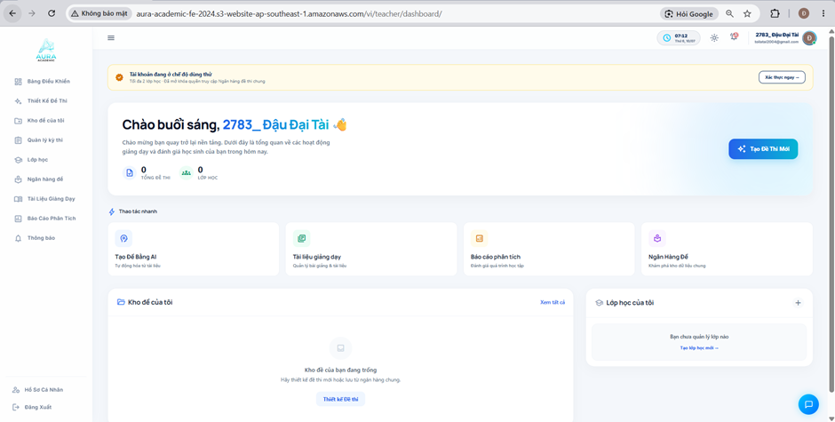
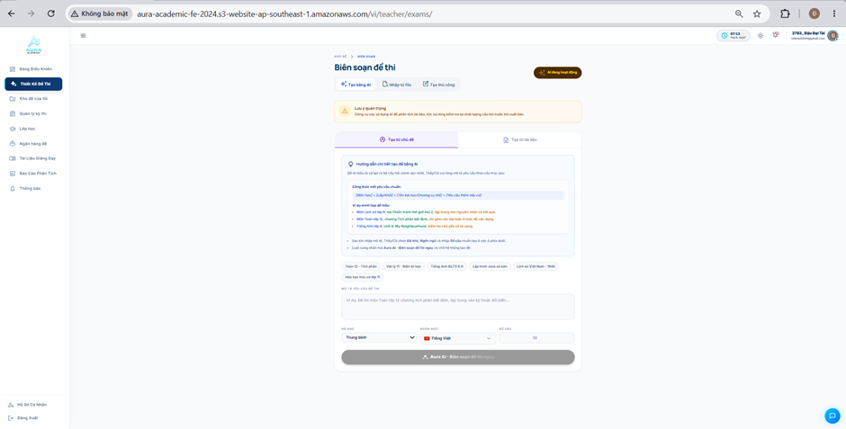
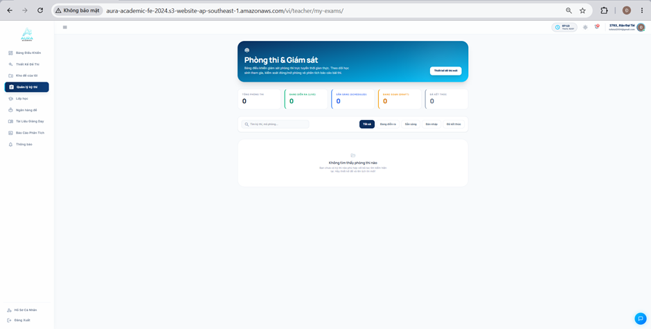
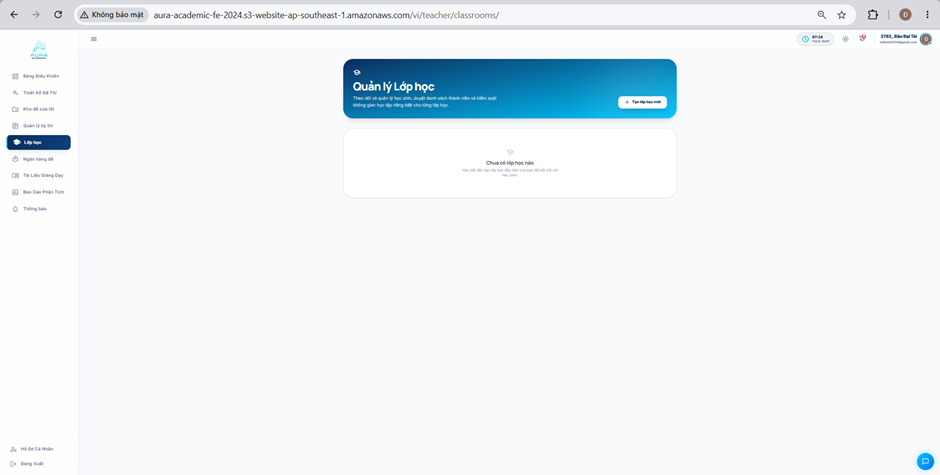
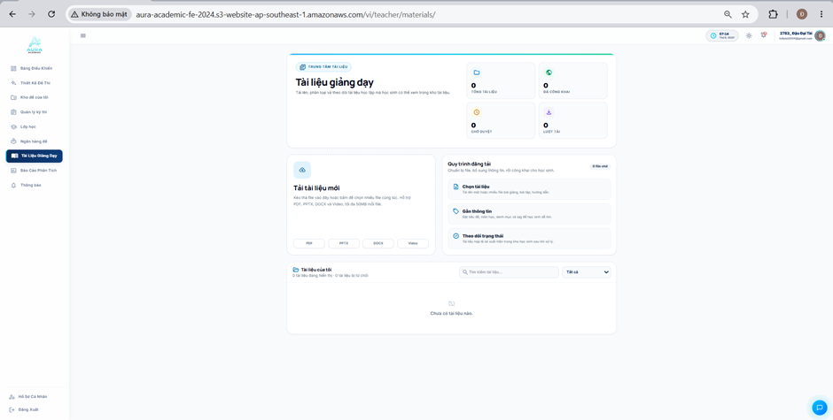
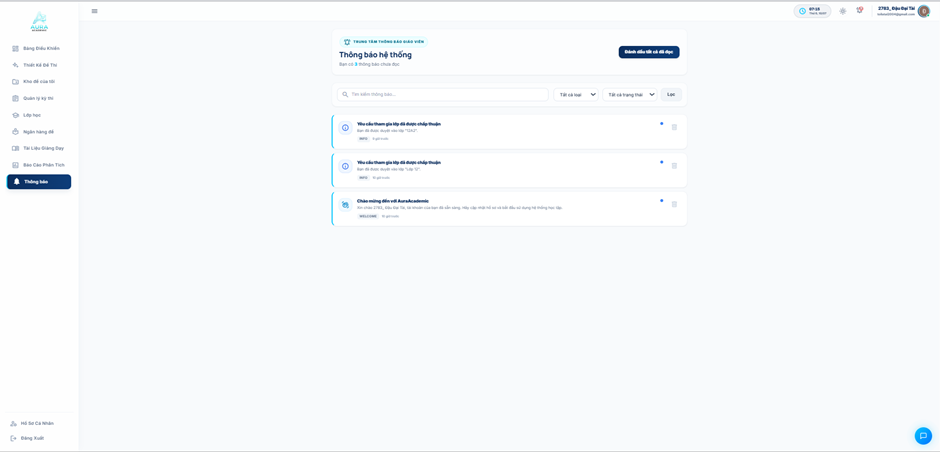
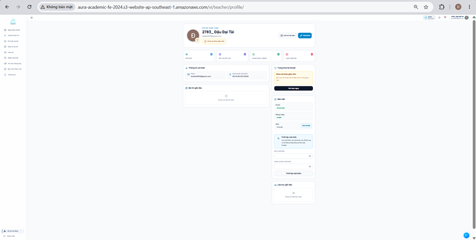

#### 5.Tổng quan về giao diện trang Dashboard , trang Biên soạn đề thi,... của hệ thống khi đăng nhập bằng tài khoản Giáo Viên: 

**Hình 5.1. Giao diện trang Dashboard dành cho tài khoản giáo viên của hệ thống**

#### 5.1.1 Mô tả giao diện của ảnh 5.1
1. Khu vực thanh điều hướng trên cùng (Top Header)
 * Thông tin hiển thị:
   * Thời gian thực (07:12 Thứ 6, 10/07).
 * Các nút tương tác:
   * Nút Menu (Icon 3 gạch): Thu gọn/mở rộng thanh Sidebar.
   * Cụm icon góc phải: Nút Theme (Sáng/Tối), Thông báo (Chuông), và Avatar Tài khoản người dùng (Hiển thị tên "2783_ Đậu Đại Tài" kèm chức năng xổ ra menu cá nhân).
2. Khu vực Menu chức năng bên trái (Teacher Sidebar)
 * Thông tin hiển thị:
   * Logo Aura Academic.
 * Các nút tương tác:
   * Danh sách tab điều hướng: Tab "Bảng Điều Khiển" đang được chọn (Active - chữ xanh đậm). Các tab chức năng dành riêng cho giáo viên bao gồm: Thiết Kế Đề Thi, Kho đề của tôi, Quản lý kỳ thi, Lớp học, Ngân hàng đề, Tài Liệu Giảng Dạy, Báo Cáo Phân Tích, Thông báo, Hồ Sơ Cá Nhân.
   * Nút Đăng xuất: Nằm ở góc dưới cùng bên trái.
3. Khu vực Cảnh báo trạng thái tài khoản (Trial/Verification Banner)
 * Thông tin hiển thị:
   * Banner nền vàng nhạt cảnh báo: "Tài khoản đang ở chế độ dùng thử" kèm theo giới hạn quyền lợi: "Tối đa 2 lớp học - Đã mở khóa quyền truy cập Ngân hàng đề thi chung".
 * Các nút tương tác:
   * Nút "Xác thực ngay ->" (Viền xanh): Nút kêu gọi hành động (Call to Action - CTA). Khi click vào, hệ thống sẽ điều hướng giáo viên đến trang nộp giấy tờ/bằng chứng để nâng cấp lên tài khoản chính thức (giống như trang duyệt xác thực bên Admin đã phân tích trước đó).
4. Khu vực Lời chào & Tổng quan (Welcome Banner)
 * Thông tin hiển thị:
   * Nền gradient xanh nhạt bắt mắt.
   * Câu chào mừng: "Chào buổi sáng, 2783_ Đậu Đại Tài 👋" và đoạn mô tả ngắn.
   * Thống kê nhanh: "0 TỔNG ĐỀ THI" và "0 LỚP HỌC".
 * Các nút tương tác:
   * Nút "✨ Tạo Đề Thi Mới" (Màu xanh đậm): Nút tác vụ chính (Primary Action) nổi bật nhất khu vực này. Bấm vào để nhảy sang quy trình tạo đề thi (bằng AI, upload file, hoặc thủ công).
5. Khu vực Thao tác nhanh (Quick Actions)
 * Thông tin hiển thị: Tiêu đề "Thao tác nhanh" (kèm icon tia sét).
 * Các nút tương tác: Khu vực này gồm 4 thẻ (Card) đóng vai trò như các phím tắt (Shortcuts) dẫn đến các tính năng dùng nhiều nhất:
   * Thẻ "Tạo Đề Bằng AI"
   * Thẻ "Tài liệu giảng dạy"
   * Thẻ "Báo cáo phân tích"
   * Thẻ "Ngân Hàng Đề"
6. Khu vực Dữ liệu cá nhân (My Data Sections)
 * Khung "Kho đề của tôi":
   * Thông tin hiển thị: Trạng thái trống "Kho đề của bạn đang trống" kèm icon và hướng dẫn.
   * Các nút tương tác: Nút text "Xem tất cả" ở góc phải trên cùng và nút viền xanh "Thiết kế Đề thi" ở giữa khung để kích hoạt hành động tạo mới.
 * Khung "Lớp học của tôi":
   * Thông tin hiển thị: Trạng thái trống "Bạn chưa quản lý lớp nào".
   * Các nút tương tác: Icon + ở góc phải trên cùng và dòng text link "Tạo lớp học mới ->" ở giữa khung.
7. Nút thả nổi (Floating Button)
 * Các nút tương tác: Nút hình tròn màu xanh có icon Tin nhắn ở góc dưới cùng bên phải màn hình (Dùng để mở hộp thoại chat hỗ trợ hoặc Live chat).

--------------------------------------------------------------------------------------------------------------

**Hình 5.2. Giao diện trang Biên soạn đề thi của hệ thống**

#### 5.1.2 Mô tả giao diện của ảnh 5.2
1. Khu vực thanh điều hướng trên cùng (Top Header)
 * Thông tin hiển thị:
   * Thời gian thực: "07:13 Thứ 6, 10/07".
 * Các nút tương tác:
   * Nút Menu (Icon 3 gạch): Thu/phóng thanh Sidebar bên trái.
   * Cụm icon góc phải: Nút Theme (Sáng/Tối), Thông báo (Chuông), và Avatar Tài khoản người dùng (Hiển thị tên "2783_ Đậu Đại Tài").
2. Khu vực Menu chức năng bên trái (Teacher Sidebar)
 * Thông tin hiển thị:
   * Logo dự án Aura Academic.
 * Các nút tương tác:
   * Danh sách tab điều hướng: Ở luồng của giáo viên, tab "Thiết Kế Đề Thi" đang được chọn (Active - nền xanh đậm, chữ trắng).
   * Nút Đăng xuất: Nằm ở góc dưới cùng bên trái.
3. Khu vực Tiêu đề trang & Thanh công cụ tạo đề (Page Header & Creation Methods)
 * Thông tin hiển thị:
   * Breadcrumb (Đường dẫn): "KHO ĐỀ > BIÊN SOẠN".
   * Tiêu đề chính: "Biên soạn đề thi".
   * Nhãn (Badge) trạng thái: Nút màu nâu/vàng có chữ "✨ AI đang hoạt động", thông báo server AI đã sẵn sàng nhận lệnh.
   * Khung cảnh báo (Màu vàng): "Lưu ý quan trọng: Công cụ này sử dụng AI để phân tích tài liệu. Xin vui lòng kiểm tra lại chất lượng câu hỏi trước khi xuất bản."
 * Các nút tương tác (Luồng chọn cách tạo đề):
   * Gồm 3 tab phương thức:
     * "✨ Tạo bằng AI" (Đang active - chữ màu xanh, có viền dưới).
     * "Nhập từ file" (Upload file Word/PDF/Excel).
     * "Tạo thủ công" (Tự nhập từng câu hỏi).
4. Khu vực Làm việc chính: Tạo đề bằng AI (AI Prompting Area)
 * Thông tin hiển thị:
   * Khung hướng dẫn xanh nhạt: "Hướng dẫn chi tiết tạo đề bằng AI", cung cấp sẵn công thức và ví dụ (Môn học + Lớp/Khối + Yêu cầu cụ thể) để giáo viên biết cách ra lệnh cho AI chuẩn xác nhất.
 * Các nút tương tác (Luồng nhập liệu AI):
   * 2 Tab nguồn dữ liệu: "Tạo từ chủ đề" (Đang active - AI tự suy luận từ kiến thức nền) và "Tạo từ tài liệu" (Giáo viên upload tài liệu riêng để AI đọc và ra đề).
   * Các thẻ gợi ý nhanh (Suggestion Chips): "Toán 12 - Tích phân", "Vật lý 11 - Điện từ học", "Tiếng Anh IELTS 6.0"... Giáo viên click vào sẽ tự động điền text vào ô mô tả bên dưới.
   * Ô nhập liệu (Text Area): "MÔ TẢ YÊU CẦU ĐỀ THI". Đây là nơi giáo viên gõ prompt (lời nhắc) chi tiết.
   * Các Dropdown & Input cấu hình:
     * ĐỘ KHÓ: Chọn mức độ (Đang hiển thị "Trung bình").
     * NGÔN NGỮ: Chọn ngôn ngữ (Đang hiển thị "Tiếng Việt").
     * SỐ CÂU: Nhập số lượng câu (Đang hiển thị "10").
   * Nút Action chính: "✨ Aura AI - Biên soạn đề thi ngay".
     * Lưu ý : Hiện tại nút này đang có màu xám (trạng thái Disabled). Trong luồng UX, nút này sẽ tự động sáng lên (có thể là màu xanh hoặc tím) chỉ khi giáo viên đã nhập nội dung vào ô "Mô tả yêu cầu đề thi".
5. Nút thả nổi (Floating Button)
 * Các nút tương tác: Nút hình tròn màu xanh có icon Tin nhắn ở góc dưới cùng bên phải màn hình.

--------------------------------------------------------------------------------------------------------------

**Hình 5.3.  Giao diện trang Kho đề của tôi của hệ thống**

#### 5.1.3 Mô tả giao diện của ảnh 5.3
1. Khu vực thanh điều hướng trên cùng (Top Header)
 * Thông tin hiển thị:
   * Thời gian thực: "07:13 Thứ 6, 10/07".
 * Các nút tương tác:
   * Nút Menu (Icon 3 gạch): Thu/phóng thanh Sidebar bên trái.
   * Cụm icon tiện ích góc phải: Nút Theme (Sáng/Tối), Thông báo (Chuông), và Avatar Tài khoản người dùng (Hiển thị tên "2783_ Đậu Đại Tài").
2. Khu vực Menu chức năng bên trái (Teacher Sidebar)
 * Thông tin hiển thị:
   * Logo dự án Aura Academic.
 * Các nút tương tác:
   * Danh sách tab điều hướng: Ở màn hình này, tab "Kho đề của tôi" đang được chọn (Active - nền xanh đậm, chữ trắng, kèm icon thư mục). Các tab khác như Bảng Điều Khiển, Thiết Kế Đề Thi, Lớp học... vẫn hiển thị bình thường.
   * Nút Đăng xuất: Nằm ở góc dưới cùng bên trái.
3. Khu vực Banner chính (Hero Banner)
 * Thông tin hiển thị:
   * Khung nền màu xanh dương đậm bo góc.
   * Tiêu đề chính: "Kho đề của tôi" (kèm icon thư mục).
   * Đoạn mô tả luồng sử dụng: "Lưu trữ các đề mẫu của bạn tự thiết kế. Nhấn nút "Sử dụng" để cấu hình, nhân bản và giao bài kiểm tra cho các lớp học."
 * Các nút tương tác:
   * Nút "✨ Thiết kế Đề thi" (Nền trắng, chữ xanh): Nút kêu gọi hành động chính (Primary Call-to-Action). Click vào đây sẽ điều hướng giáo viên quay lại trang "Biên soạn đề thi" để bắt đầu tạo mới một bộ đề.
4. Khu vực Thanh công cụ Tìm kiếm & Hiển thị (Toolbar)
 * Thông tin hiển thị:
   * Bộ đếm tổng số bản ghi: "0 bản mẫu" (Nằm ở góc phải).
 * Các nút tương tác:
   * Ô nhập liệu (Search Box): Có placeholder "Tìm kiếm đề mẫu..." kèm icon kính lúp, dùng để gõ từ khóa tìm nhanh bộ đề đã tạo.
   * Cụm nút chuyển đổi giao diện (View Toggles): Kế bên ô tìm kiếm, gồm 2 icon để giáo viên chọn cách hiển thị danh sách đề thi theo Dạng danh sách (List view) hoặc Dạng lưới thẻ (Grid view). Hiện tại icon List view đang được active (màu xanh).
5. Khu vực Không gian dữ liệu (Data Area / Empty State)
 * Thông tin hiển thị:
   * Do chưa có bộ đề nào được lưu, khu vực này đang hiển thị Trạng thái trống (Empty State).
   * Icon hình thư mục mờ.
   * Tiêu đề: "Kho đề trống".
   * Dòng chữ hướng dẫn: "Thiết kế đề thi và bấm "Lưu vào Kho đề" để lưu trữ các đề mẫu của bạn ở đây."
 * Các nút tương tác: Hiện tại không có nút bấm trực tiếp trong khung trống này. Tuy nhiên, nếu đã có dữ liệu, đây sẽ là nơi hiển thị danh sách các bộ đề. Lúc đó, mỗi bộ đề sẽ đi kèm các nút thao tác cực kỳ quan trọng như "Sử dụng/Giao bài", "Chỉnh sửa", "Nhân bản (Clone)", hoặc "Xóa".
6. Nút thả nổi (Floating Button)
 * Các nút tương tác: Nút hình tròn màu xanh có icon Tin nhắn ở góc dưới cùng bên phải màn hình (để mở Live chat hoặc AI support).

--------------------------------------------------------------------------------------------------------------

**Hình 5.4. Giao diện trang Quản lý tài liệu của hệ thống**

#### 5.1.4 Mô tả giao diện của ảnh 5.4
1. Khu vực thanh điều hướng trên cùng (Top Header)
 * Thông tin hiển thị:
   * Thời gian thực: "07:13 Thứ 6, 10/07".
 * Các nút tương tác:
   * Nút Menu (Icon 3 gạch): Thu gọn/mở rộng thanh Sidebar bên trái.
   * Cụm icon tiện ích góc phải: Nút Theme (Sáng/Tối), Thông báo (Chuông), và Avatar Tài khoản người dùng (Hiển thị tên "2783_ Đậu Đại Tài").
2. Khu vực Menu chức năng bên trái (Teacher Sidebar)
 * Thông tin hiển thị:
   * Logo dự án.
 * Các nút tương tác:
   * Danh sách tab điều hướng: Tab "Quản lý kỳ thi" đang được chọn (Active - nền xanh đậm, chữ trắng, kèm icon bảng kẹp tài liệu/bài kiểm tra).
   * Nút Đăng xuất: Nằm ở góc dưới cùng bên trái.
3. Khu vực Banner chính (Hero Banner)
 * Thông tin hiển thị:
   * Khung nền gradient màu xanh dương nổi bật.
   * Tiêu đề chính: "Phòng thi & Giám sát" (kèm icon mạng lưới/kết nối).
   * Đoạn mô tả: "Bảng điều khiển giám sát phòng thi trực tuyến thời gian thực. Theo dõi học sinh tham gia, kiểm soát đóng/mở phòng và phân tích báo cáo bài thi."
 * Các nút tương tác:
   * Nút "Thiết kế đề thi mới" (Nền trắng, chữ xanh): Nút hành động chính (Primary Call-to-Action). Click vào đây sẽ điều hướng giáo viên sang trang "Biên soạn đề thi" để thiết lập một phòng thi mới.
4. Khu vực Thẻ thống kê trạng thái (Status Summary Cards)
 * Thông tin hiển thị: Gồm 5 thẻ thống kê số lượng phòng thi chia theo trạng thái (hiện tại tất cả đều là 0), có kèm mã màu trực quan:
   * TỔNG PHÒNG THI: 0
   * ĐANG DIỄN RA (LIVE): 0 (Màu xanh lá)
   * SẴN SÀNG (SCHEDULED): 0 (Màu xanh dương)
   * ĐANG SOẠN (DRAFT): 0 (Màu cam)
   * ĐÃ KẾT THÚC: 0 (Màu xám)
 * Các nút tương tác: Tương tự giao diện Admin, các thẻ này có thể đóng vai trò như những nút bấm; khi click vào, hệ thống sẽ tự động lọc danh sách phòng thi ở bên dưới theo trạng thái tương ứng.
5. Khu vực Tìm kiếm & Bộ lọc (Search & Filters)
 * Thông tin hiển thị: Không có thông tin tĩnh.
 * Các nút tương tác:
   * Ô nhập liệu (Search Box): Có placeholder "Tìm kỳ thi, mã phòng..." kèm icon kính lúp để giáo viên tra cứu nhanh.
   * Các nút lọc trạng thái (Pill buttons): Gồm Tất cả (đang active - màu xanh đậm), Đang diễn ra, Sẵn sàng, Bản nháp, Đã kết thúc. Bấm vào để thu hẹp kết quả hiển thị bên dưới.
6. Khu vực Danh sách phòng thi (Data Area / Empty State)
 * Thông tin hiển thị:
   * Do chưa có dữ liệu phòng thi nào được tạo, khu vực này đang hiển thị Trạng thái trống (Empty State).
   * Icon hình thư mục mờ.
   * Tiêu đề: "Không tìm thấy phòng thi nào".
   * Dòng chữ hướng dẫn: "Bạn chưa có kỳ thi nào phù hợp với bộ lọc tìm kiếm hiện tại. Hãy thiết kế đề và lên lịch thi mới!"
 * Các nút tương tác: Hiện tại không có nút bấm trực tiếp trong khung trống này. Trong thực tế (khi có dữ liệu), khu vực này sẽ hiển thị các thẻ (Card) phòng thi tương tự như bên Admin. Tại mỗi thẻ sẽ có các nút hành động quan trọng như "Vào giám sát", "Đóng phòng", hoặc "Bắt đầu thi".
7. Nút thả nổi (Floating Button)
 * Các nút tương tác: Nút hình tròn màu xanh có icon Tin nhắn ở góc dưới cùng bên phải màn hình (Dùng để mở khung chat hỗ trợ trực tuyến).

--------------------------------------------------------------------------------------------------------------

**Hình 5.5. Giao diện trang Quản lý lớp học của hệ thống**

#### 5.1.5 Mô tả giao diện của ảnh 5.5
1. Khu vực thanh điều hướng trên cùng (Top Header)
 * Thông tin hiển thị:
   * Thời gian thực: "07:14 Thứ 6, 10/07".
 * Các nút tương tác:
   * Nút Menu (Icon 3 gạch): Thu gọn/mở rộng thanh Sidebar bên trái.
   * Cụm icon tiện ích góc phải: Nút Theme (đổi giao diện Sáng/Tối), Thông báo (Chuông), và Avatar Tài khoản người dùng (Hiển thị tên "2783_ Đậu Đại Tài").
2. Khu vực Menu chức năng bên trái (Teacher Sidebar)
 * Thông tin hiển thị:
   * Logo dự án Aura Academic.
 * Các nút tương tác:
   * Danh sách tab điều hướng: Ở màn hình này, tab "Lớp học" đang được chọn (Active - nền xanh đậm, chữ trắng, kèm icon mũ cử nhân).
   * Nút Đăng xuất: Nằm ở góc dưới cùng bên trái.
3. Khu vực Banner chính (Hero Banner)
 * Thông tin hiển thị:
   * Khung nền gradient màu xanh dương mang lại cảm giác hiện đại.
   * Tiêu đề chính: "Quản lý Lớp học" (kèm icon mũ cử nhân).
   * Đoạn mô tả: "Theo dõi và quản lý học sinh, duyệt danh sách thành viên và kiểm soát không gian học tập riêng biệt cho từng lớp học."
 * Các nút tương tác (Luồng tạo lớp):
   * Nút "+ Tạo lớp học mới" (Nền trắng, chữ xanh): Đây là nút Gọi hành động chính (Primary Action). Khi Giáo viên click vào nút này, hệ thống thường sẽ bật lên một Hộp thoại (Modal/Popup) yêu cầu điền các thông tin cơ bản như: Tên lớp, Môn học, Khối lớp. Sau khi tạo thành công, hệ thống sẽ sinh ra một Mã Lớp (Class Code) để giáo viên gửi cho học sinh tham gia.
4. Khu vực Danh sách Lớp học (Data Area / Empty State)
 * Thông tin hiển thị:
   * Do tài khoản này chưa tạo lớp nào, khu vực này đang hiển thị Trạng thái trống (Empty State).
   * Icon hình mũ cử nhân mờ.
   * Tiêu đề: "Chưa có lớp học nào".
   * Dòng chữ hướng dẫn: "Hãy bắt đầu tạo lớp học đầu tiên của bạn để kết nối với học sinh."
 * Các nút tương tác: * Hiện tại không có nút bấm trực tiếp trong khung trống này.
   * Lưu ý để demo khi có dữ liệu: Khi giáo viên đã tạo lớp, khu vực này sẽ biến thành danh sách các Thẻ Lớp Học (Class Cards). Giáo viên có thể click trực tiếp vào một thẻ lớp để đi sâu vào trang "Chi tiết lớp học" (Nơi chứa danh sách học sinh, bài tập đã giao, bảng điểm riêng của lớp đó) hoặc click các nút phụ như "Chỉnh sửa thông tin lớp", "Khóa lớp", "Xóa lớp".
5. Nút thả nổi (Floating Button)
 * Các nút tương tác: Nút hình tròn màu xanh có icon Tin nhắn ở góc dưới cùng bên phải màn hình (Dùng để mở khung chat hỗ trợ hoặc trao đổi nhanh).

--------------------------------------------------------------------------------------------------------------

**Hình 5.6. Giao diện trang Ngân hàng đề thi của hệ thống**

#### 5.1.6 Mô tả giao diện của ảnh 5.6
1. Khu vực thanh điều hướng trên cùng (Top Header)
 * Thông tin hiển thị:
   * Thời gian thực: "07:14 Thứ 6, 10/07".
 * Các nút tương tác:
   * Nút Menu (Icon 3 gạch): Thu gọn/mở rộng thanh Sidebar bên trái.
   * Cụm icon tiện ích góc phải: Nút Theme (Sáng/Tối), Thông báo (Chuông), và Avatar Tài khoản người dùng (Hiển thị tên "2783_ Đậu Đại Tài").
2. Khu vực Menu chức năng bên trái (Teacher Sidebar)
 * Thông tin hiển thị:
   * Logo dự án Aura Academic.
 * Các nút tương tác:
   * Danh sách tab điều hướng: Tab "Ngân hàng đề" đang được chọn (Active - nền xanh đậm, chữ trắng, kèm icon tòa nhà ngân hàng).
   * Nút Đăng xuất: Nằm ở góc dưới cùng bên trái.
3. Khu vực Banner chính & Thống kê (Hero Banner & Stats)
 * Thông tin hiển thị:
   * Khung nền xanh dương đậm rất nổi bật.
   * Tiêu đề chính: "Ngân hàng Đề thi" (kèm icon tòa nhà).
   * Đoạn mô tả: "Quản lý đề luyện tập được chia sẻ trong hệ thống, lọc nhanh theo cấp bậc và môn học."
   * 3 Thẻ thống kê mini: * 0 Tổng đề: Tổng số đề hiện có trong ngân hàng.
     * 0 Đang lọc: Số lượng đề hiển thị sau khi áp dụng bộ lọc.
     * 21 Môn học: Cho thấy hệ thống đã cấu hình sẵn dữ liệu của 21 môn học khác nhau.
 * Các nút tương tác (Luồng chia sẻ đề thi):
   * Nút "+ Thêm từ Kho đề" (Nền trắng, chữ xanh): Nút hành động chính (Primary Action). Bấm vào đây sẽ mở ra popup danh sách các đề thi mà giáo viên đã lưu trong "Kho đề của tôi". Giáo viên chọn đề và xác nhận để đẩy đề đó lên Ngân hàng chung, chia sẻ công khai cho học sinh toàn trường luyện tập.
4. Khu vực Thanh công cụ Tìm kiếm & Bộ lọc (Toolbar & Filters)
 * Thông tin hiển thị: Không có thông tin tĩnh.
 * Các nút tương tác:
   * Ô nhập liệu (Search Box): "Tìm theo tên đề thi..." dùng để gõ từ khóa tìm kiếm nhanh.
   * Các Dropdown Bộ lọc (Filters): Gồm 3 tiêu chí lọc chi tiết để dễ dàng tìm kiếm trong kho dữ liệu lớn:
     * Tất cả cấp bậc (Icon nón cử nhân màu xanh lá) -> Lọc theo lớp 10, 11, 12 hoặc Đại học...
     * Tất cả môn học (Icon phân tử màu tím) -> Lọc theo Toán, Lý, Hóa, Anh...
     * Tất cả độ khó (Icon biểu đồ màu cam) -> Lọc theo Dễ, Trung bình, Khó.
   * Cụm nút chuyển đổi giao diện (View Toggles): Tùy chọn hiển thị danh sách đề thi theo Dạng danh sách (List view) hoặc Dạng lưới thẻ (Grid view).
   * Nút/Nhãn "0 đề thi" (Màu xanh đậm): Đóng vai trò hiển thị tổng số kết quả tìm kiếm/lọc hoặc làm nút Submit (áp dụng bộ lọc).
5. Khu vực Danh sách dữ liệu (Data Area / Empty State)
 * Thông tin hiển thị:
   * Do ngân hàng chung hiện chưa có đề nào, khu vực này đang hiển thị Trạng thái trống (Empty State) với khung viền đứt nét (Dashed border).
   * Icon hình tài liệu bị mờ.
   * Dòng chữ: "Ngân hàng chưa có đề thi nào".
 * Các nút tương tác: Hiện tại không có nút bấm. Trong thực tế, khi ngân hàng có dữ liệu, nơi đây sẽ hiển thị các đề thi công khai. Giáo viên có thể click vào để Xem trước (Preview) cấu trúc đề hoặc xem các chỉ số lượt làm bài của học sinh đối với bộ đề đó.
6. Nút thả nổi (Floating Button)
 * Các nút tương tác: Nút hình tròn màu xanh có icon Tin nhắn ở góc dưới cùng bên phải màn hình.

--------------------------------------------------------------------------------------------------------------

**Hình 5.7. Giao diện trang Tài liệu giảng dạy của hệ thống**

#### 5.1.7 Mô tả giao diện của ảnh 5.7
1. Khu vực thanh điều hướng trên cùng (Top Header)
 * Thông tin hiển thị:
   * Thời gian thực: "07:14 Thứ 6, 10/07".
 * Các nút tương tác:
   * Nút Menu (Icon 3 gạch): Thu gọn/mở rộng thanh Sidebar bên trái.
   * Cụm icon tiện ích góc phải: Nút Theme (đổi giao diện Sáng/Tối), Thông báo (Chuông), và Avatar Tài khoản người dùng (Hiển thị tên "2783_ Đậu Đại Tài").
2. Khu vực Menu chức năng bên trái (Teacher Sidebar)
 * Thông tin hiển thị:
   * Logo dự án Aura Academic.
 * Các nút tương tác:
   * Danh sách tab điều hướng: Tab "Tài Liệu Giảng Dạy" đang được chọn (Active - nền xanh đậm, chữ trắng, kèm icon cuốn sách/tài liệu).
   * Nút Đăng xuất: Nằm ở góc dưới cùng bên trái.
3. Khu vực Tiêu đề & Thống kê tổng quan (Header & Stats)
 * Thông tin hiển thị:
   * Nhãn nhỏ: "TRUNG TÂM TÀI LIỆU".
   * Tiêu đề chính: "Tài liệu giảng dạy".
   * Đoạn mô tả: "Tải lên, phân loại và theo dõi tài liệu học tập mà học sinh có thể xem trong kho tài liệu."
   * 4 Thẻ thống kê mini: Hiển thị tổng quan các luồng tài liệu của giáo viên này (hiện tại đều là 0):
     * 0 TỔNG TÀI LIỆU (Icon thư mục)
     * 0 ĐÃ CÔNG KHAI (Icon quả địa cầu - tài liệu đã được Admin duyệt)
     * 0 CHỜ DUYỆT (Icon đồng hồ - tài liệu vừa up lên đang đợi Admin xử lý)
     * 0 LƯỢT TẢI (Icon download - thống kê tương tác của học sinh)
 * Các nút tương tác: Các thẻ thống kê này thường có thể click vào để làm bộ lọc nhanh cho danh sách bên dưới (ví dụ: bấm vào "Chờ duyệt" để xem các file đang kẹt lại).
4. Khu vực Tải lên & Hướng dẫn (Upload Zone & Process Guide)
 * Khung "Tải tài liệu mới" (Bên trái):
   * Thông tin hiển thị: Icon đám mây. Dòng hướng dẫn: "Kéo thả file vào đây hoặc bấm để chọn nhiều file cùng lúc. Hỗ trợ PDF, PPTX, DOCX và Video, tối đa 50MB mỗi file." Dưới cùng là các nhãn định dạng hỗ trợ (PDF, PPTX, DOCX, Video).
   * Các nút tương tác: Toàn bộ khung viền đứt nét này là một Khu vực Kéo/Thả (Drag & Drop Zone). Giáo viên có thể kéo file từ máy tính thả vào đây, hoặc click trực tiếp vào vùng này để mở cửa sổ chọn file của hệ điều hành.
 * Khung "Quy trình đăng tải" (Bên phải):
   * Thông tin hiển thị: Bộ đếm "0 file chờ" ở góc phải (hiển thị số lượng file đang trong hàng đợi upload). Bên dưới là 3 bước hướng dẫn cực kỳ rõ ràng cho luồng UX:
     * Chọn tài liệu: Tải lên một hoặc nhiều file...
     * Gắn thông tin: Đặt tiêu đề, môn học, danh mục và tag...
     * Theo dõi trạng thái: Tài liệu hợp lệ sẽ xuất hiện...
   * Các nút tương tác: Khung này chủ yếu mang tính chất hướng dẫn tĩnh (Info box), giúp người dùng mới hiểu rõ quy trình mà không bị bỡ ngỡ.
5. Khu vực Danh sách "Tài liệu của tôi" (My Materials List)
 * Thông tin hiển thị:
   * Tiêu đề khu vực: "Tài liệu của tôi" kèm thống kê nhỏ "(0 tài liệu đang hiển thị - 0 tài liệu bị từ chối)".
   * Trạng thái trống (Empty State): Do chưa có file nào, phần thân dưới hiện icon tệp tin mờ và dòng chữ "Chưa có tài liệu nào."
 * Các nút tương tác:
   * Ô tìm kiếm (Search Box): "Tìm kiếm tài liệu..." để gõ từ khóa.
   * Dropdown Lọc trạng thái: Đang ở tùy chọn "Tất cả". Giáo viên có thể xổ xuống để lọc theo "Đã duyệt", "Chờ duyệt", hoặc "Bị từ chối".
   * Lưu ý khi demo: Khi có dữ liệu, khu vực trống bên dưới sẽ là danh sách các tài liệu (dạng bảng hoặc thẻ). Tại đó sẽ có các nút hành động như Xem chi tiết, Chỉnh sửa thông tin, hoặc Xóa file.
6. Nút thả nổi (Floating Button)
 * Các nút tương tác: Nút hình tròn màu xanh có icon Tin nhắn ở góc dưới cùng bên phải màn hình (Dùng để mở chat hỗ trợ).

--------------------------------------------------------------------------------------------------------------

**Hình 5.8. Giao diện trang  Báo cáo phân tích của hệ thống**

#### 5.1.8 Mô tả giao diện của ảnh 5.8
Đặc biệt lưu ý cho buổi workshop: Giao diện trang này đang gặp lỗi nghiêm trọng về đa ngôn ngữ (i18n bug) tương tự như một phần ở trang tạo đề thi lúc nãy. Hệ thống không load được text tiếng Việt mà đang hiển thị trực tiếp các biến code (keys). Bạn nhớ ghi chú lại để báo Dev team fix gấp nhé!
Dưới đây là chi tiết các thành phần trên màn hình:
1. Khu vực thanh điều hướng trên cùng (Top Header)
 * Thông tin hiển thị:
   * Thời gian thực: "07:15 Thứ 6, 10/07".
 * Các nút tương tác:
   * Nút Menu (Icon 3 gạch): Thu gọn/mở rộng thanh Sidebar bên trái.
   * Cụm icon tiện ích góc phải: Nút Theme (Sáng/Tối), Thông báo (Chuông), và Avatar Tài khoản người dùng (Hiển thị tên "2783_ Đậu Đại Tài").
2. Khu vực Menu chức năng bên trái (Teacher Sidebar)
 * Thông tin hiển thị:
   * Logo dự án Aura Academic.
 * Các nút tương tác:
   * Danh sách tab điều hướng: Tab "Báo Cáo Phân Tích" đang được chọn (Active - nền xanh đậm, chữ trắng, kèm icon biểu đồ cột).
   * Nút Đăng xuất: Nằm ở góc dưới cùng bên trái.
3. Khu vực Tiêu đề trang (Page Header - Đang lỗi hiển thị)
 * Thông tin hiển thị: * Thay vì hiển thị tiêu đề tiếng Việt (ví dụ: "Báo cáo & Thống kê"), trang đang hiển thị biến code: TeacherReports.page_title (kèm icon cuốn sổ/biểu đồ).
   * Dòng mô tả phụ cũng bị lỗi hiển thị biến code: TeacherReports.page_desc.
 * Các nút tương tác: Không có nút bấm ở khu vực này.
4. Khu vực Nội dung chính (Empty State - Đang lỗi hiển thị)
 * Thông tin hiển thị:
   * Trang hiện đang ở trạng thái không có dữ liệu (Empty State), nhưng toàn bộ text hướng dẫn đều bị lỗi key.
   * Icon biểu đồ mờ gạch chéo (thể hiện không có data).
   * Tiêu đề trạng thái trống: TeacherReports.no_reports (Lẽ ra phải là "Chưa có báo cáo nào").
   * Dòng hướng dẫn chi tiết: TeacherReports.no_reports_desc (Lẽ ra phải là mô tả hướng dẫn giáo viên tổ chức thi để có dữ liệu báo cáo).
 * Các nút tương tác: Hiện tại không có nút bấm nào trong khung trống này.
   * Lưu ý khi demo thực tế (sau khi fix bug và có dữ liệu): Khu vực này sẽ là nơi render các biểu đồ (Charts) thể hiện phổ điểm, thống kê tỷ lệ đạt/trượt của các lớp học, và danh sách báo cáo chi tiết cho từng kỳ thi mà giáo viên đó quản lý.
5. Nút thả nổi (Floating Button)
 * Các nút tương tác: Nút hình tròn màu xanh có icon Tin nhắn ở góc dưới cùng bên phải màn hình (Mở khung chat/hỗ trợ).

--------------------------------------------------------------------------------------------------------------

**Hình 5.9. Giao diện trang thông báo của hệ thống**

#### 5.1.9 Mô tả giao diện của ảnh 5.9
1. Khu vực thanh điều hướng trên cùng (Top Header)
 * Thông tin hiển thị:
   * Thời gian thực: "07:15 Thứ 6, 10/07".
 * Các nút tương tác:
   * Nút Menu (Icon 3 gạch): Thu gọn/mở rộng thanh Sidebar bên trái.
   * Cụm icon tiện ích góc phải: Nút Theme (Sáng/Tối), Thông báo (Chuông - đang có dấu chấm đỏ báo hiệu có thông báo mới), và Avatar Tài khoản người dùng (Hiển thị tên "2783_ Đậu Đại Tài").
2. Khu vực Menu chức năng bên trái (Teacher Sidebar)
 * Thông tin hiển thị:
   * Logo dự án Aura Academic.
 * Các nút tương tác:
   * Danh sách tab điều hướng: Tab "Thông báo" đang được chọn (Active - nền xanh đậm, chữ trắng, kèm icon chiếc chuông).
   * Nút Đăng xuất: Nằm ở góc dưới cùng bên trái.
3. Khu vực Tiêu đề trang & Thao tác chính (Page Header)
 * Thông tin hiển thị:
   * Nhãn (Badge) nhận diện: "TRUNG TÂM THÔNG BÁO GIÁO VIÊN" (chữ màu xanh ngọc).
   * Tiêu đề chính: "Thông báo hệ thống".
   * Đoạn mô tả/Thống kê: "Bạn có 3 thông báo chưa đọc". Chữ số 3 được tô màu xanh nổi bật để thu hút sự chú ý.
 * Các nút tương tác:
   * Nút "Đánh dấu tất cả đã đọc" (Nút nền xanh đậm, góc phải): Đây là nút chức năng UX rất quan trọng. Khi click vào, hệ thống sẽ gọi API chuyển trạng thái toàn bộ thông báo từ "Chưa đọc" sang "Đã đọc", đồng thời tắt dấu chấm đỏ ở icon chuông trên Header.
4. Khu vực Tìm kiếm & Lọc (Search & Filters)
 * Thông tin hiển thị: Không có thông tin tĩnh.
 * Các nút tương tác:
   * Ô tìm kiếm (Search input): "Tìm kiếm thông báo..." kèm icon kính lúp để tra cứu theo từ khóa.
   * Dropdown "Tất cả loại": Nhấn vào để lọc theo loại thông báo (ví dụ: Hệ thống, Lớp học, Nhắc nhở...).
   * Dropdown "Tất cả trạng thái": Nhấn vào để lọc thông báo theo trạng thái "Đã đọc" hoặc "Chưa đọc".
   * Nút "Lọc" (Nút xám nhạt): Bấm để áp dụng các điều kiện tìm kiếm và dropdown vừa chọn.
5. Khu vực Danh sách Thông báo (Notifications List)
 * Thông tin hiển thị (Trên mỗi thẻ thông báo):
   * Dấu hiệu nhận biết thông báo chưa đọc: Mỗi thẻ đều có một đường viền dọc màu xanh (left border) ở cạnh trái và một chấm xanh (blue dot) ở góc phải.
   * Thẻ 1 & 2: Cùng chủ đề "Yêu cầu tham gia lớp đã được chấp thuận". Nội dung chi tiết: "Bạn đã được duyệt vào lớp '12A2'" và "lớp 'Lớp 12'". Kèm nhãn INFO (Thông tin) và thời gian (6 giờ trước, 10 giờ trước).
   * Thẻ 3: Chủ đề "Chào mừng đến với AuraAcademic". Nội dung lời chào gửi đến tài khoản. Kèm nhãn WELCOME (Chào mừng) và thời gian (10 giờ trước).
 * Các nút tương tác:
   * Click vào toàn bộ thẻ: Thường sẽ đánh dấu thông báo đó là "Đã đọc" (biến mất viền xanh và chấm xanh), đồng thời có thể điều hướng người dùng đến trang liên quan (ví dụ: trang chi tiết của lớp học 12A2).
   * Nút Xóa (Icon thùng rác): Nằm ở cạnh phải của mỗi thẻ. Bấm vào để xóa thông báo đó khỏi danh sách.
6. Nút thả nổi (Floating Button)
 * Các nút tương tác: Nút hình tròn màu xanh có icon Tin nhắn ở góc dưới cùng bên phải màn hình.

--------------------------------------------------------------------------------------------------------------

**Hình 5.10. Giao diện trang Hồ sơ cá nhân của hệ thống**

#### 5.1.9 Mô tả giao diện của ảnh 5.9
1. Khu vực thanh điều hướng trên cùng (Top Header)
 * Thông tin hiển thị:
   * Thời gian thực (Góc phải trên cùng).
 * Các nút tương tác:
   * Nút Menu (Icon 3 gạch): Thu gọn/mở rộng thanh Sidebar bên trái.
   * Cụm icon tiện ích góc phải: Nút Theme (Sáng/Tối), Thông báo (Chuông), và Avatar Tài khoản.
2. Khu vực Menu chức năng bên trái (Teacher Sidebar)
 * Thông tin hiển thị:
   * Logo dự án Aura Academic.
 * Các nút tương tác:
   * Danh sách tab điều hướng: Ở màn hình này, tab "Hồ Sơ Cá Nhân" (nằm ở gần dưới cùng) đang được chọn (Active - nền xanh đậm, chữ trắng, kèm icon user).
   * Nút Đăng xuất: Nằm ở góc dưới cùng bên trái.
3. Khu vực Thẻ thông tin định danh (Profile Header Card)
 * Thông tin hiển thị:
   * Avatar chữ "Đ" với một badge cảnh báo màu vàng (chấm than) báo hiệu tài khoản chưa hoàn tất xác thực.
   * Nhãn vai trò: "HỒ SƠ GIÁO VIÊN".
   * Tên người dùng: "2783_ Đậu Đại Tài".
   * Email đăng nhập.
   * Nhãn trạng thái (Pill): "Chưa xác thực giáo viên" (màu vàng).
 * Các nút tương tác:
   * Nút "Đổi ảnh đại diện" (Icon camera): Click để upload avatar mới từ máy tính.
   * Nút "Sửa hồ sơ" (Màu xanh đậm, icon cây bút): Bấm vào thường sẽ mở ra một form để cập nhật họ tên, số điện thoại, ngày sinh...
4. Khu vực Thống kê hoạt động cá nhân (Stats Row)
 * Thông tin hiển thị: Gồm 4 chỉ số tổng quan của giáo viên này trên hệ thống:
   * LỚP HỌC: 0 (Icon nón cử nhân)
   * BÀI THI ĐÃ TẠO: 0 (Icon tệp tin)
   * ĐANG HOẠT ĐỘNG: 0 (Icon play)
   * LƯỢT NỘP BÀI: 0 (Icon check)
 * Các nút tương tác: Các thẻ này chủ yếu là thông tin tĩnh hiển thị thành tựu/mức độ hoạt động.
5. Khu vực Cột trái (Thông tin & Lịch sử)
 * Khung "Thông tin cá nhân":
   * Thông tin hiển thị: Email và Thời gian đăng nhập cuối cùng (VD: 00:10:06 10/7/2026).
 * Khung "Bài thi gần đây":
   * Thông tin hiển thị: Trạng thái trống "Chưa có bài thi nào."
6. Khu vực Cột phải (Xác thực & Bảo mật tài khoản)
Khu vực này chứa các luồng (flows) cực kỳ quan trọng đối với tài khoản giáo viên:
 * Khung "Trạng thái tài khoản":
   * Thông tin hiển thị: Cảnh báo màu vàng "Chưa xác thực giáo viên" và yêu cầu bổ sung minh chứng.
   * Các nút tương tác: Nút "Xác thực ngay" (Màu xanh đen). Click vào sẽ đưa giáo viên đến luồng upload thẻ giáo viên/CCCD để Admin duyệt, từ đó mở khóa các tính năng giới hạn (như tạo nhiều hơn 2 lớp học).
 * Khung "Bảo mật":
   * Thông tin hiển thị: Email (Đã xác thực - chữ xanh), Đăng nhập (Qua Google). Trạng thái 2FA (Đang Tắt).
   * Các nút tương tác: Nút "Bật mã / Bật" (Màu xanh nhạt) để kích hoạt bảo mật 2 lớp (2FA).
 * Khung "Thiết lập mật khẩu":
   * Thông tin hiển thị: Box thông báo hướng dẫn tạo mật khẩu cho tài khoản đăng nhập bằng Google.
   * Các nút tương tác: * 2 Ô nhập liệu (Inputs): "Mật khẩu mới" và "Xác nhận mật khẩu mới" (Kèm icon con mắt để ẩn/hiện password).
     * Nút "Thiết lập mật khẩu" (Viền xám): Nhấn để lưu password mới.
 * Khung "Lớp học gần đây":
   * Thông tin hiển thị: Trạng thái trống "Chưa có lớp học nào."
