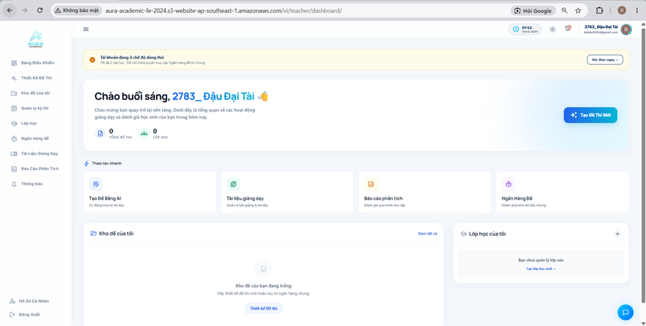
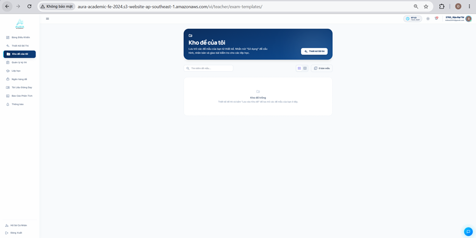
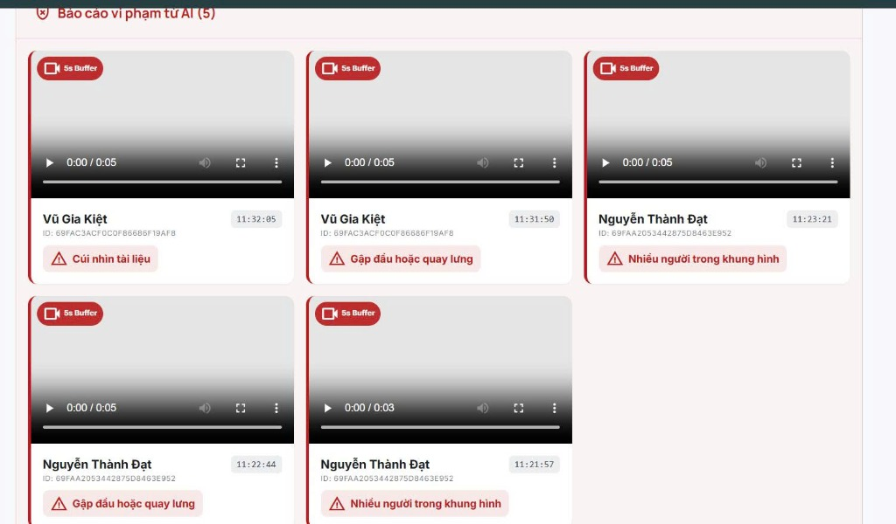
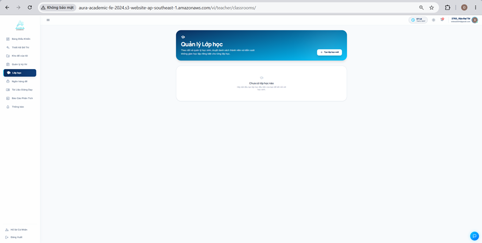
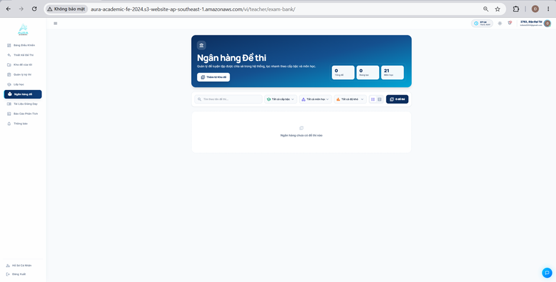
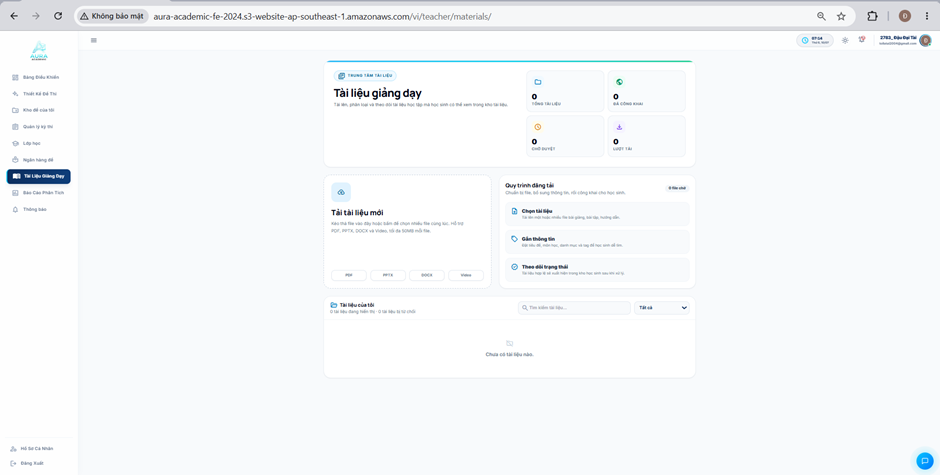
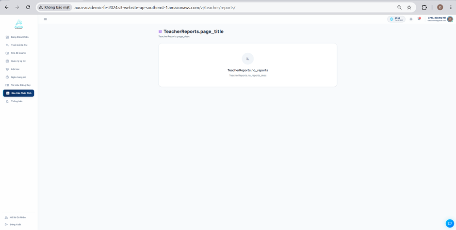
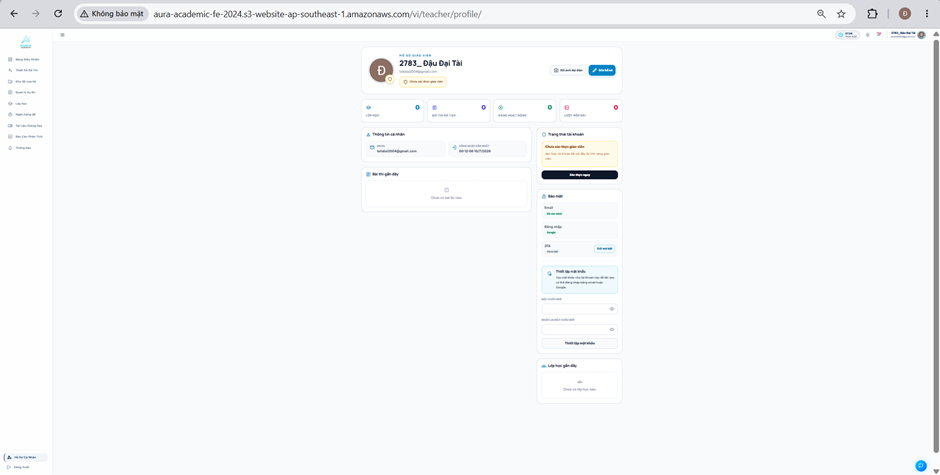

# Dashboard Giảng dạy, Biên soạn Đề, Quản lý Lớp & Giám sát Thi

Phần này giới thiệu hệ thống chức năng chuyên biệt dành cho Giáo viên (Teacher) trên **Aura Academic**, hỗ trợ tối đa quy trình giảng dạy, quản lý lớp học, soạn thảo đề thi và giám sát thi trực tuyến.

---

### 1. Dashboard Quản lý Giảng dạy

**Hình 5.1. Giao diện trang Dashboard dành cho tài khoản giáo viên của hệ thống**

**Chức năng chính:**
- **Thống kê tổng quan lớp học:** Theo dõi nhanh Lớp phụ trách, Số lượng đề thi cá nhân, Bài kiểm tra đang mở và Tỷ lệ học viên đạt yêu cầu.
- **Lịch trình giảng dạy:** Lịch biểu trực quan hiển thị các kỳ thi sắp diễn ra và danh sách công việc cần xử lý nhanh trong ngày.

---

### 2. Trình Biên soạn Đề kiểm tra

**Hình 5.2. Giao diện trang Biên soạn đề thi của hệ thống**

**Chức năng chính:**
- **Công cụ tạo đề linh hoạt:** Soạn câu hỏi trắc nghiệm, tự luận kèm lời giải chi tiết và thang điểm cụ thể cho từng câu.
- **Chế độ xem trước (Preview):** Xem trước chính xác giao diện đề thi hiển thị dưới góc nhìn của học viên trước khi phát hành chính thức.

---

### 3. Quản lý Kho đề Cá nhân (My Question Repository)

**Hình 5.3. Giao diện trang Kho đề của tôi của hệ thống**

**Chức năng chính:**
- **Lưu trữ đề kiểm tra riêng:** Nơi quản lý các đề thi do chính giáo viên biên soạn, tách biệt hoàn toàn với ngân hàng đề chung của trường.
- **Thao tác linh hoạt:** Nhân bản (Clone) đề kiểm tra cũ để chỉnh sửa nhanh cho lớp khác, hoặc chia sẻ đề cho tổ bộ môn.

---

### 4. Phòng thi & Giám sát Trực tuyến (Proctoring)

**Hình 5.4. Giao diện trang Phòng thi & giám sát trực tuyến**

**Hình 5.4b. Giao diện báo cáo vi phạm tự động từ AI YOLO (YOLO Proctoring V1.0)**

**Chức năng chính:**
- **Theo dõi thời gian thực:** Giám sát trạng thái làm bài của từng học viên trong phòng thi (Đang làm, Đã nộp, Mất kết nối).
- **Phát hiện vi phạm tự động AI YOLO:** Hệ thống AI tự động phân tích luồng camera liên tục bằng mô hình YOLO, phát hiện và lưu lại đoạn video ngắn (5s buffer) cho các vi phạm như: "Cúi nhìn tài liệu", "Gập đầu hoặc quay lưng", "Nhiều người trong khung hình". Giúp giáo viên có bằng chứng trực quan, xác đáng để kiểm soát gian lận.
- **Hỗ trợ kịp thời:** Nhận cảnh báo khi học viên rời tab/chuyển màn hình và hỗ trợ gia hạn thời gian làm bài khi xảy ra sự cố kỹ thuật.

---

### 5. Quản lý Lớp học & Thành viên

**Hình 5.5. Giao diện trang Quản lý lớp học của hệ thống**

**Chức năng chính:**
- **Quản lý danh sách lớp được giao:** Xem danh sách học viên, phát hành bài tập và thông báo riêng cho từng lớp phụ trách.
- **Ghi nhận tiến bộ học tập:** Theo dõi mức độ hoàn thành bài tập và chuyên cần của từng học sinh trong lớp.

---

### 6. Khai thác Ngân hàng Đề thi Chung

**Hình 5.6. Giao diện trang Ngân hàng đề thi của hệ thống**

**Chức năng chính:**
- **Tra cứu câu hỏi chuẩn hóa:** Tìm kiếm, lựa chọn và trích xuất câu hỏi từ kho đề chung của nhà trường để tổ hợp thành đề kiểm tra riêng cho lớp mình.
- **Bộ lọc theo ma trận đề:** Lọc câu hỏi nhanh theo độ khó và chuyên đề để xây dựng đề thi đúng chuẩn ma trận quy định.

---

### 7. Quản lý Tài liệu Giảng dạy

**Hình 5.7. Giao diện trang Tài liệu giảng dạy của hệ thống**

**Chức năng chính:**
- **Đăng tải bài giảng & Slide:** Tổ chức thư mục tài liệu bài giảng, bài tập mẫu để gửi trực tiếp đến các lớp học đang phụ trách.
- **Chia sẻ tài liệu linh hoạt:** Kiểm soát quyền tải về hoặc xem trực tiếp tài liệu đối với học viên.

---

### 8. Báo cáo Phân tích Điểm số Lớp học

**Hình 5.8. Giao diện trang Báo cáo phân tích của hệ thống**

**Chức năng chính:**
- **Phân tích phổ điểm:** Thống kê biểu đồ điểm trung bình của lớp, tỉ lệ học sinh khá/giỏi và phát hiện kịp thời những học viên cần bồi dưỡng thêm.
- **Phân tích độ khó câu hỏi:** Thống kê tỷ lệ trả lời đúng/sai của từng câu hỏi trong đề thi để giáo viên điều chỉnh phương pháp giảng dạy phù hợp.

---

### 9. Gửi Thông báo đến Lớp học

**Hình 5.9. Giao diện trang thông báo của hệ thống**

**Chức năng chính:**
- **Truyền đạt thông tin tức thì:** Soạn và gửi thông báo nhắc nhở lịch thi, lịch nộp bài tập hoặc thay đổi phòng học trực tiếp đến toàn bộ học viên trong lớp.
- **Theo dõi trạng thái đọc:** Kiểm tra số lượng học viên đã xem và tiếp nhận thông báo.

---

### 10. Hồ sơ & Cài đặt Giảng viên

**Hình 5.10. Giao diện trang Hồ sơ cá nhân của hệ thống**

**Chức năng chính:**
- **Hồ sơ giảng dạy:** Cập nhật thông tin học hàm/học vị, bộ môn giảng dạy và thông tin liên hệ dành cho học viên.
- **Cấu hình bảo mật:** Đổi mật khẩu và cài đặt các thông báo email tự động khi học viên nộp bài thi.
